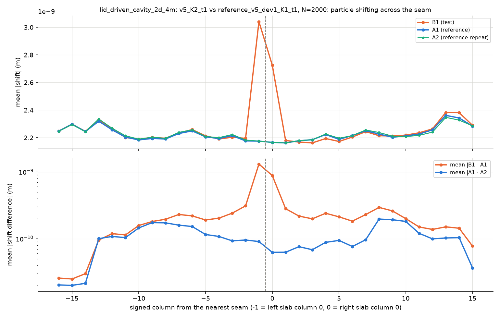
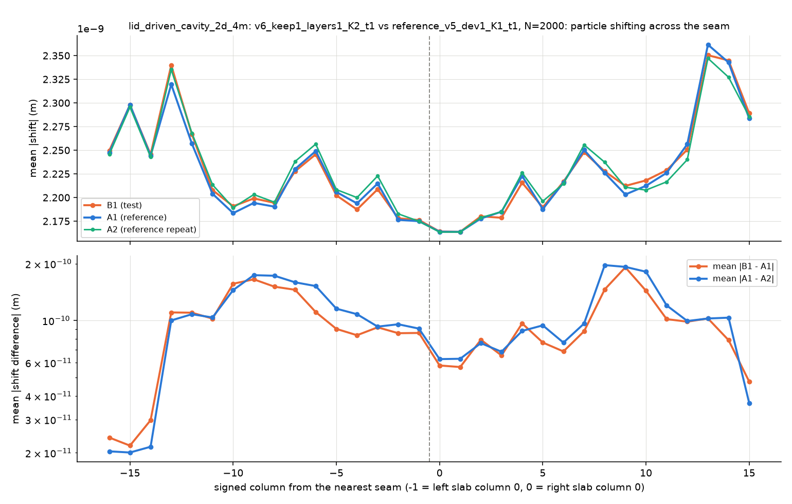
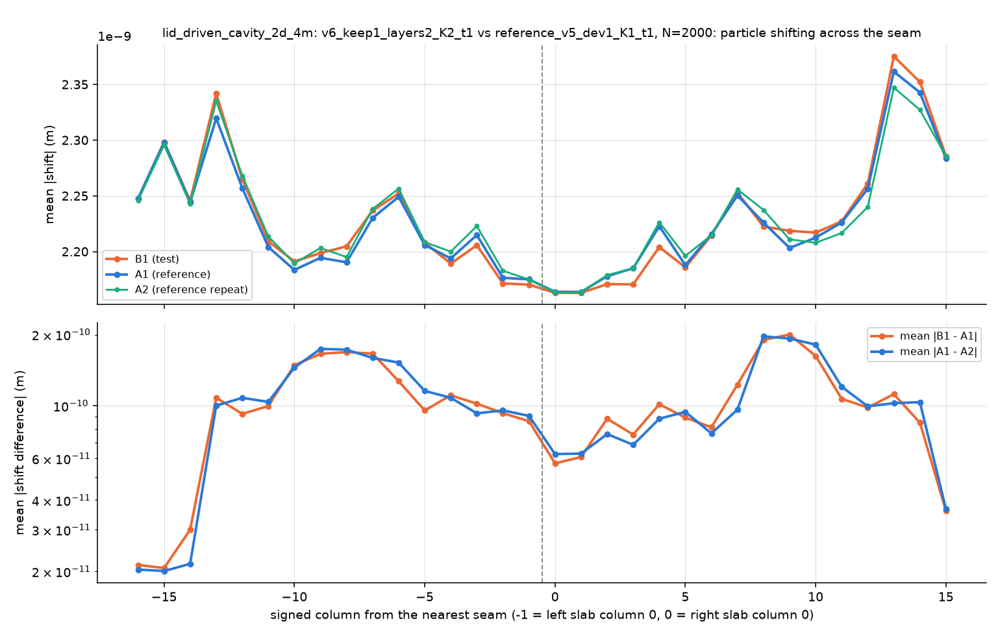
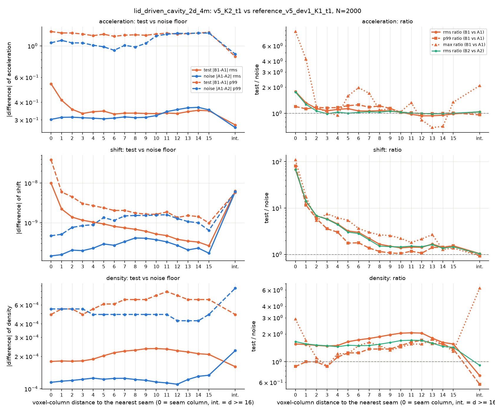
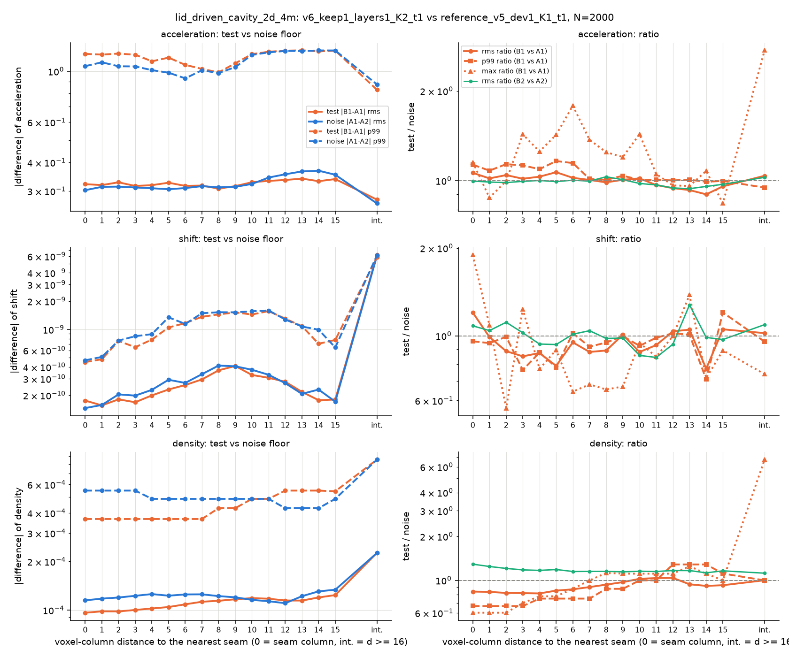
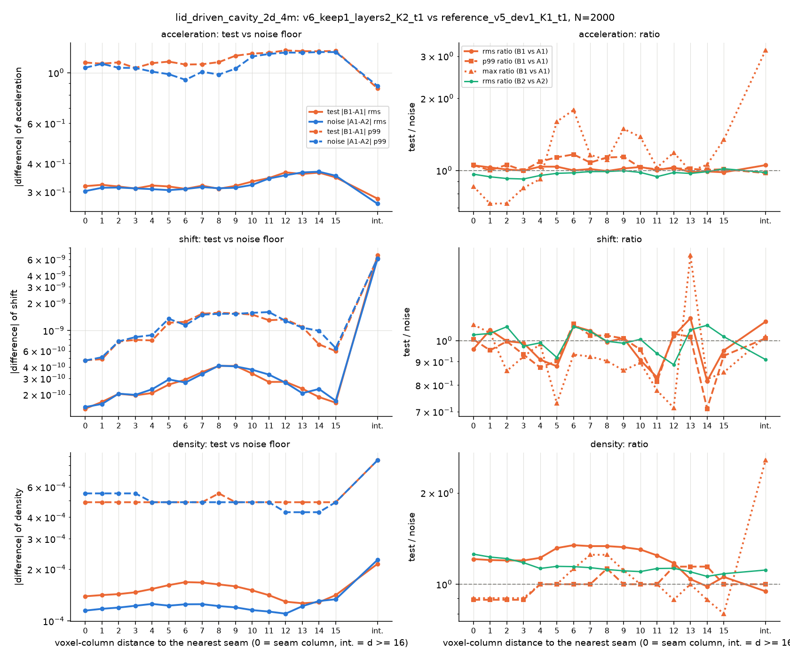
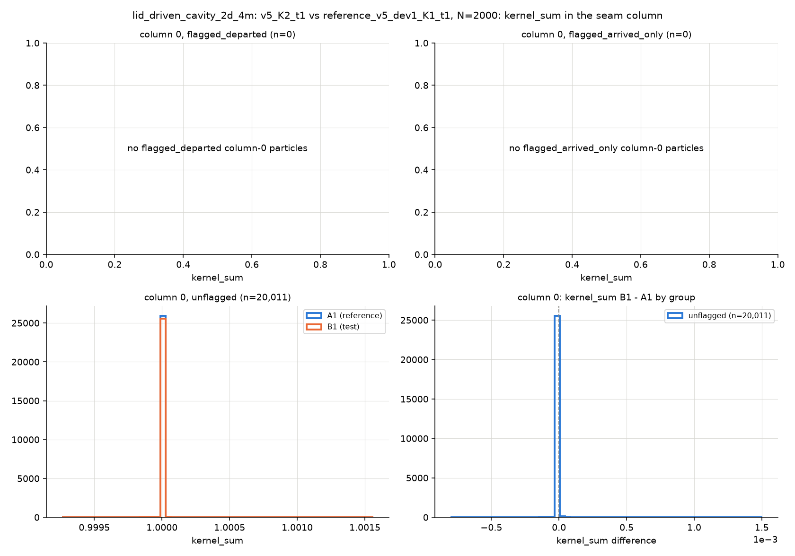
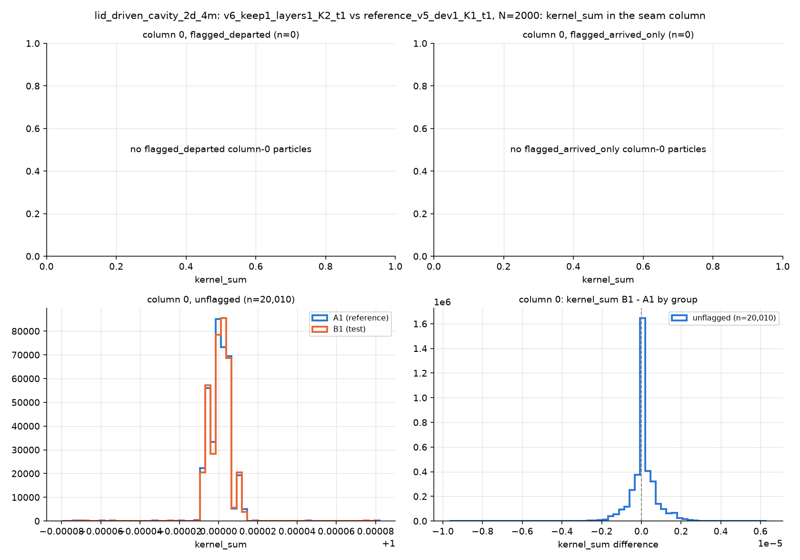
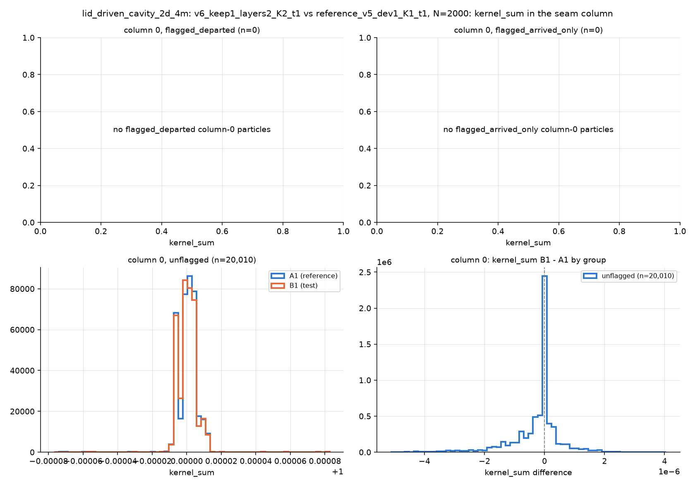

# v6 seam 修复与逐粒子 seam 审计(2026-10-02)

## 结论(TL;DR)

- **v5 的 seam 不等价是真实且大的,主因是缺陷 2(离开的 migrant 丢失一步)。** 在有越界的帧里,邻近一个刚离开本 slab 的粒子的 column 0 流体粒子,其加速度与 K = 1 的差是 K = 1 两次运行之间噪声底的 **99–176 倍**(rms 比值;2-D 1M/4M,K = 2/4),密度差 14–54 倍,kernel_sum 平均低 1.3–1.6 %(正好是少了一个邻居的 V·W)。同一位置、旁边只有"进入"粒子或距越界粒子 h–1.5 h 的粒子也被带偏 12–34 倍(这些位置反复发生越界,前几步的误差留在了状态里)。
- **误差在 seam 列留下持续的印记。** N = 2000、K = 2 的主 dump(该帧本身没有越界):column 0 的 shift 差是噪声的 29 倍(1M)/68 倍(4M),kernel_sum 15/55 倍,速度 10.5/8.9 倍,加速度 1.06/1.79 倍;seam 两侧 column 0 的平均 |shift| 比单卡大 25–40 %;印记沿 x 衰减约 3–4 列,远到 ±12 列仍可见。N = 300 时 4M 已有印记(shift 10 倍、速度 37 倍),1M 还没有;(1,1) 同样消掉 4M 的这部分印记,说明 4M 在前 300 步已有越界,而 1M 在第 101–300 帧的窗口里一次越界也没有。
- **v6 (0,1) = v5。** 所有比值与 v5 在噪声内一致(窗口 departed 组 149 / 176 / 98.9 / 124 对 v5 的 149 / 176 / 98.5 / 122),确认默认开关下 v6 与 v5 等价。
- **v6 (1,1)(只保留 departed)消除了全部可测的 seam 误差。** 窗口内 departed / arrived / 对照三组的比值回到 0.97–1.33;N = 2000 主 dump 的 column 0:加速度 1.00–1.06、shift 0.85–1.20、速度 0.63–1.05、kernel_sum 0.82–1.31,全部落在远列(d ≥ 8)比值本身的噪声带里(远列 p5–p95:加速度 0.93–1.12、shift 0.75–1.51、速度 0.61–1.18、kernel_sum 0.71–3.46);shift 剖面整条与参考重合。
- **v6 (1,2)(再加 2 层 ghost)在这里测不出额外改进。** 各比值与 (1,1) 同在噪声带内(窗口三组 0.6–1.4,主 dump 加速度 0.97–1.05、shift 0.96–1.63、kernel_sum 1.02–1.16):缺陷 1(column 0 的 force 读 ghost 的 ρⁿ,Pⁿ)对这些算例、这些 horizon 的影响低于 K = 1 两次运行之间的浮点混沌噪声。要单独量化缺陷 1 需要从同一状态重启、只走一步的对比(见"局限")。
- **性能**(v6 (0,1) 与 v5 相差 −0.3 %…+0.3 %;(1,1) 在 2-D 1M/4M/16M 与 3-D 8M 为 99.8–100.2 %,窄 slab(12/14 列)98.8 %;(1,2) 在 2-D 为 99.3–100.7 %,3-D 8M 为 97.7 %(3-D 的 band kernel 吞吐受限,G1 列让 phase C 多约 1 ms);2-D 16M 的 (1,2) density band 多 63 µs(派发越过一波,lanes = 32 可消除),fps 不受影响)。(1,2) 把每 link 每帧主机拷贝减少约 23–30 %(replica 只带 4 个字段)。
- **不变量:** 审计与性能的全部运行 drift = 0、stamp = 0、所有 overflow = 0、far_migration = 0。departed 每帧峰值 2-D 为 2–5(容量 64–202),3-D 8M 为 197(容量 784;z 方向均匀的早期流动让一整排约 200 个格点粒子同一帧越线)。
- **K = 4 偶发卡死(既有问题):** 审计中一次 4M、(0,1)、K = 4 的运行在第 1260 帧卡住(sim0 的 phase A 等待已满足却不执行,两个 sim 共用一张卡),与本机已知的 WDDM 多 context 问题一致,与 v6 改动无关(该配置等价于 v5);这个对比只用了 1 轮。

## 背景:v5 在 seam 处与单卡不等价的两点

freeze-2026-09-17 (`eda4b8f`,之后只换了邻居循环顺序 `f9c660e`) 的多卡步:

| 阶段 | 做什么 |
|---|---|
| A1–A2 | predict(kick + drift,越过 seam 的粒子追加进 ghost voxel 的 incoming 表)→ update_voxel(只 own voxel) |
| A3 | ghost_send:把 own column 0 打包成 replica(10 个字段,`density_pressure` 此时是 ρⁿ,Pⁿ),把 ghost voxel incoming 表里的粒子打包成 migrant 并 kill 掉自己的槽 |
| B | correction_interior / density_deep_interior / force_deep_interior(不碰 ghost,与传输并行) |
| C | C1 install_migrations → C2 correction band(2 列)→ C3 density band(3 列,写 scratch)→ C4 scratch→primary(只 own 区间)→ C5 force band(4 列) |

由此:

1. **C5 force 中 column 0 的 ghost 邻居读到 ρⁿ, Pⁿ**:replica 在 A3 打包,早于本步 density;单卡的 force 读 ρⁿ⁺¹, Pⁿ⁺¹。correction(C2)与 density(C3)读 ρⁿ 本来就是对的,只有 force 读旧值。
2. **发送方在 A3 kill 的 migrant,在本步 C2–C5 中既不在 own 列表也不在 G 列表**:G 列表被上传覆盖成邻居的 replica,而邻居打包 replica 时还没 install 这个粒子。发送方 column 0 少一个邻居一步(kernel_sum 少 V_j W_ij,correction / density / force 都少一项)。

已有检查都看不到:`_verify_cascade_force.py` 是链对链(两边同样有这两个缺陷);`_run_v5_equivalence.py` 的包络本身含 |K1 − K2|。

## 工具:`experiment/seam_audit/`

| 文件 | 作用 |
|---|---|
| `dump_state.py` | GPU 进程,一次跑一个配置(v5 / v6,任意 K),在每个 horizon 存全体粒子 |
| `analyze.py` | CPU 分析:KD-tree 匹配、按 B 的 seam 分列统计、column 0 分组、kernel_sum 分布、shift 剖面、自检 |
| `crossing_window.py` / `window_analysis.py` | 越界捕获窗口(两遍法)与窗口内 column 0 分组统计 |
| `run_matrix.py` | 整场驱动:子进程、超时、续跑、两遍窗口、分析、汇总 |
| `perf_campaign.py` | 性能交错测试 |
| `matrix_v5_baseline.json` / `matrix_v6.json` | 本文的两个矩阵 |

**全局 id。** 不改求解器:在 dump 进程里 monkeypatch `_build_initial_data`,把初始全局下标写进 `extension_fields`(.z = id // 2²⁰,.w = id % 2²⁰,float32 精确)。ghost_send / install / defrag / departed 都按位复制这个字段,所以 id 跟随粒子跨卡、跨 defrag。bootstrap 后逐 slab 校验 id 与分区掩码逐位一致。

**比值。** 每个配置跑两次:A1, A2(参考,v5 K=1),B1, B2(被测)。B1 的每个粒子 i 用 KD-tree 在 A1 里找最近粒子 a(i)(容差 0.05 h),再从 a(i) 找 A2 的 b。在同一批粒子上:

    test  = |B1_i − A1_a|        noise = |A1_a − A2_b|        ratio = rms(test) / rms(noise)

noise 是参考自身的逐次噪声底(atomicAdd 槽位顺序 → 求和顺序 → 混沌放大)。按 B 的 seam 分列:全局列 c = floor((x − origin_x)/h),最近 cut s,无符号距离 d = c − s(c ≥ s)或 s − 1 − c;d = 0 是两侧的 column 0。只统计流体粒子(壁面在任何一次运行里都不受力)。id 匹配作为交叉校验,报告一致率。

**column 0 分两组。** "本步 h 内有越界粒子":另一个在本步越过 seam 的粒子与它距离 < h(Wendland 核在 r ≥ h 为 0)。细分 departed(越界粒子离开了它所在的 slab,即缺陷 2 的受害者)与 arrived(只有进入本 slab 的越界粒子)。另输出 column 0 的 kernel_sum 分布(B1、A1 与 B1 − A1)和跨 seam 的 |shift| 剖面(有符号列 −16..15)。

**越界捕获窗口(两遍法)。** 在这些 horizon 上越界很少:2-D 1M 在第 101–300 帧没有任何粒子越过 seam 线,N = 2000 前 400 帧里只有约 30 个越界粒子分布在约 26 帧。单帧 dump 的 flagged 组因此几乎总是空的。做法:

1. 被测运行在 N = 2000 前的 W 帧(2-D 1M 400 帧,4M 与 3-D 200 帧)逐帧推进;每帧用常驻映射的 staging 只回读 own 区间的位置与 id,找出 x 越过任一审计 cut 线的粒子;只在有越界的帧读全状态,存下越界粒子周围 1.5 h 内的全部粒子。
2. `--build-capture-requests` 把一个算例所有被测运行(两个矩阵)的 (帧, id) 取并集。
3. 参考运行(K = 1)推进同一窗口,按请求只存这些 (帧, id)。K = 1 的同一粒子越线时刻会因振荡和轨迹发散差一两帧,所以让参考自己检测越线时 B 的行一个都匹配不上;请求法保证参考里有对应行。
4. `window_analysis` 把窗口内所有帧汇总:departed / arrived / 对照组(距越界粒子 h–1.5 h 的 column 0 粒子:同时同地,但没有越界邻居)。

## v6 的改动

`experiment/v6` 由 `experiment/v5` 的 **HEAD** 复制(不含 v5 工作树里另一个会话未提交的 cavity-validation 诊断开关),模块 / 类 / import 改为 v6,开关前缀 `V6_`。

**默认值与 v5 等价的证据:**

- 复制后、改动前,v6 编出的 10 个 SPIR-V 与 v5 已提交的 `spv/` 逐字节相同;
- `experiment/v6/_test_seam_layout.py`(CPU):`V6_GHOST_LAYERS=1` 时 v6 的链分区与每方向传输段在 K = 2, 3, 4 下与 v5 逐字段相同;
- `experiment/v6/_test_partition_chain.py`(v5 的 M2 回归,复制):2950 项全过;
- 审计矩阵里 v6 (0,1) 与 v5 的 seam 比值逐项一致(见下),性能为 v5 的 99.7–100.3 %。

### `V6_KEEP_DEPARTED=1`(修缺陷 2)

| 位置 | 改动 |
|---|---|
| pid 空间 | trailing ghost 池之后新增 departed 池 `[L+O+T+1, L+O+T+D]`(`Capacities.departed_pool_size`,spec 常量 84)。不在任何传输段、不在 own 派发范围、不在 C4 的 own 区间拷贝内。 |
| `ghost_send.comp` | 每个外发 migrant 在 kill 自己的槽之前,先把 10 个字段复制进 departed 池,`position.w` 写它漂入的 ghost voxel(发送方自己的网格编号)。`departed_count` 是每帧的分配计数(phase A 清零,两个方向共用),`peak_departed_count`(pool_health,不清零)记每帧最大值。 |
| `append_departed.comp`(新) | phase C,install 之后、band sweep 之前:把每个 departed 副本追加进本卡对应 ghost voxel 的列表。上传刚把这些列表覆盖成邻居的 replica——邻居打包它们时还没 install 这些粒子——追加之后发送方的 ghost 列正好等于邻居 install 之后的 seam 列。用 CAS 追加,绝不超过 `MAX_PARTICLES_PER_VOXEL`(邻居循环以 count 为上界)。 |
| 溢出 | 池满或 ghost 列表满 → `overflow_departed_count`(累计),非零即判 run 无效。 |
| 容量 | 每 slab `max(64, ceil(0.25 × 面 voxel 数 × peer 侧数))`(`V6_DEPARTED_FACE_FRACTION`,`V6_DEPARTED_CAPACITY` 覆盖),不按 NY·NZ·C_inc 开;实测峰值见下。 |

### `V6_GHOST_LAYERS=2`(需 KEEP_DEPARTED=1;修缺陷 1)

| 位置 | 改动 |
|---|---|
| 分区 | 每个有 peer 的一侧 ghost 厚 2 列:G1 = 邻居 column 0(紧贴 own),G2 = 邻居 column 1。链路 voxel id 偏移改为指向接收方**最内层** ghost 列(trailing 发送时为 `receiver.leading_thickness − 1`;1 层时与 v5 完全相同)。偏移是 x 方向的纯平移,同一个值把发送方 seam 列映到接收方 G1、把其后一列映到 G2、把发送方 G1 映到接收方 seam 列(migrant)。 |
| ghost 池 | 每方向 `[G1 replica R | G2 replica R | migrant M]`,R = v5 的每方向池(同样乘 `V6_GHOST_POOL_FACTOR`),M = 面 × MAX_INCOMING × factor(`replica_region_size`,spec 常量 86)。两个 replica 区各有分配计数;`ghost_send_<dir>_count` 变成 migrant 计数,仍是接收方的 install 计数。 |
| `ghost_send.comp` | 每个 (y,z) 线程、每层:own 列 `boundary ∓ layer` 的 replica 写进邻居期望的那一列 outbox;replica 只带 sweep 实际读的 4 个字段(position_voxel_id、velocity_mass、density_pressure、material);migrant 来自两列 ghost 的 incoming 表(外层只在一步跨两列时出现,计入 `far_migration_count`,必须为 0),带全字段,并照常写 departed 副本。 |
| 传输 | G1、G2 replica 区 × 4 字段,migrant 区 × 9 字段,两列 ghost 的 voxel 列表,三个计数(migrant → install 计数;replica 计数 → 接收方诊断槽,同时给 count-aware 主机拷贝定界),frame stamp 仍在最后 4 字节。 |
| `install_migrations.comp` | 只遍历 migrant 区。 |
| band 派发 | correction 与 density 的 BOUNDARY 管线(band-voxel dispatch)在每个有 peer 的一侧多走一列——G1(含 departed 副本)——当作 self 计算(spec 常量 85 `GHOST_SELF_LAYER`):先由 G2 + G1 + own column 0 算 G1 的 correction,再算 G1 的 ρⁿ⁺¹, Pⁿ⁺¹。 |
| C4 拷贝 | scratch → primary 覆盖 own 区间 + 每方向 G1 replica 区 + departed 池,于是 C5 的 force 对每个 ghost 邻居都读到本步的 ρ/P。G2 保持上传来的 ρⁿ(它只在拷贝之前作为 G1 的邻居被读)。 |
| bootstrap | 在 `correction_all` / `density_all` 之后同样补一遍 G1-as-self。 |

还要求 `V6_BAND_VOXEL_DISPATCH=1`(生产默认)与 `V6_KEEP_DEPARTED=1`(否则 G1 自身的邻居集合缺少本帧到达的粒子);启动时检查。

**对抗式审查。** 改动完成后用三个视角(shader 正确性、主机侧、seam 等价语义)各一名审查者 + 每条发现一名反驳者审查。物理视角逐条核对:own column 0 的邻居集合无重复无遗漏;G1-as-self 的邻居集合与输入(xⁿ⁺¹、vⁿ⁺¹ᐟ²、primary 中的 ρⁿ、material、C2 算出的 self correction)与 owner 自己算的完全一致,唯一差别是求和顺序;C4 覆盖了 G1 列表可能引用的所有 pid;G2 在 C4 之后不被读;bootstrap、phase B、defrag 归零都一致。唯一确认的问题(轻微):`GHOST_LAYERS=2` 下一步跨两列的 migrant(CFL 下不可能)会装进接收方 column 1,而 column 2 的 correction 已在 phase B 算完——v5 中同样的位移会把粒子推出扩展网格、以 drift ≠ 0 大声失败,v6 中只记在 `far_migration_count`。已把它列为必须为 0 的不变量(chain bench、perf、审计都检查);同时给新增计数器的清零加了正确的 compute→transfer(clear)屏障。

## 审计矩阵

| 项 | 设置 |
|---|---|
| 算例 | 2-D 1M `cases/lid_driven_cavity_2d_gen`(1,046,529 粒子,206 列)与 2-D 4M `cases/lid_driven_cavity_2d_4m`(4,182,025 粒子,410 列);h/dx = 5,c0 = 100,γ = 7,lid 1 m/s |
| horizon | N = 300 与 N = 2000(同一次运行连续推进,两处各存一次全体粒子) |
| 参考 A | v5,K = 1,无显示的 5090(device 1),2 轮 |
| 被测 B | v5、v6 (0,1)、v6 (1,1)、v6 (1,2),各 K = 2(device 0,1)与 K = 4(0,1,0,1,每卡 2 个 sim),各 2 轮 |
| 开关 | 生产配置:`*_WORKER_COUNT_AWARE=1 *_GHOST_POOL_FACTOR=0.25 *_SPLIT_TRANSFER_QUEUES=1 *_CASCADE_FORCE=1 *_BAND_VOXEL_DISPATCH=1`,depth 2,pool_safety 1.2,per-direction,defrag 每 1000 步,验证层关闭 |
| 窗口 | N = 2000 之前:1M 400 帧、4M 200 帧(两遍法) |
| 匹配 | KD-tree,容差 0.05 h;id 一致率全部为 1.0;N = 2000 时 1M 有 265–606 个、4M 有 641–1,311 个粒子超出容差(A1–A2 自身是 400 / 1,311,同量级) |
| 规模 | v5 被测 10 次(含 2 次 3-D)、v6 被测 24 次(其中 1 次卡死)、参考 4 次,共 37 次有效 + 1 次失败;另有 1 次 3-D v6 运行在启动时按要求停掉。32 个对比(2-D)。3-D 审计按要求暂停,v5 的两次 3-D 被测运行已存未分析 |

比值 = rms(|B1 − A1|) / rms(|A1 − A2|),同一批流体粒子。"第二对" = B2 对 A2(噪声 A2 对 A1)。4M、(0,1)、K = 4 只有一轮(见上)。

## 结果 1:越界窗口里的 column 0(缺陷 2 的直接测量)

| 算例 | 配置 | K | 有越界的帧 | 越界粒子 | departed n | departed 加速度 | departed 密度 | departed kernel_sum | departed ΔΣW 均值 | arrived n | arrived 加速度 | 对照 n | 对照 加速度 | 未匹配 |
|---|---|---|---|---|---|---|---|---|---|---|---|---|---|---|
| 2-D 1M | v5 | 2 | 26 | 30 | 290 | 149 | 54.3 | 12846 | -1.49e-02 | 290 | 33.5 | 334 | 12.1 | 0 |
| 2-D 1M | v5 | 4 | 26 | 30 | 867 | 176 | 48.4 | 9466 | -1.49e-02 | 872 | 28.4 | 1003 | 14.0 | 0 |
| 2-D 1M | v6 (0,1) | 2 | 26 | 30 | 290 | 149 | 53.8 | 13951 | -1.49e-02 | 290 | 33.8 | 334 | 12.2 | 0 |
| 2-D 1M | v6 (0,1) | 4 | 27 | 30 | 867 | 176 | 48.4 | 9595 | -1.49e-02 | 872 | 28.6 | 1003 | 13.9 | 0 |
| 2-D 1M | v6 (1,1) | 2 | 26 | 30 | 290 | 1.03 | 1.01 | 1.31 | -9.43e-08 | 281 | 1.11 | 343 | 1.01 | 0 |
| 2-D 1M | v6 (1,1) | 4 | 26 | 30 | 861 | 1.07 | 1.03 | 1.00 | +2.24e-07 | 844 | 1.12 | 1036 | 1.10 | 0 |
| 2-D 1M | v6 (1,2) | 2 | 26 | 30 | 286 | 1.00 | 1.11 | 1.38 | +2.65e-07 | 281 | 1.20 | 347 | 1.01 | 0 |
| 2-D 1M | v6 (1,2) | 4 | 26 | 30 | 860 | 1.01 | 0.94 | 1.13 | +4.03e-08 | 845 | 1.04 | 1037 | 1.04 | 0 |
| 2-D 4M | v5 | 2 | 13 | 21 | 199 | 98.5 | 30.5 | 12505 | -1.31e-02 | 198 | 20.0 | 214 | 12.5 | 0 |
| 2-D 4M | v5 | 4 | 10 | 21 | 590 | 122 | 13.9 | 3995 | -1.58e-02 | 595 | 24.3 | 666 | 24.5 | 0 |
| 2-D 4M | v6 (0,1) | 2 | 13 | 20 | 199 | 98.9 | 30.3 | 13600 | -1.55e-02 | 198 | 19.3 | 214 | 12.2 | 0 |
| 2-D 4M | v6 (0,1) | 4 | 10 | 21 | 590 | 124 | 14.2 | 3919 | -1.58e-02 | 594 | 24.3 | 666 | 24.0 | 0 |
| 2-D 4M | v6 (1,1) | 2 | 10 | 20 | 209 | 1.11 | 1.33 | 1.00 | +4.16e-08 | 207 | 0.98 | 286 | 1.06 | 0 |
| 2-D 4M | v6 (1,1) | 4 | 11 | 21 | 613 | 1.12 | 0.97 | 1.26 | -1.88e-06 | 610 | 1.01 | 746 | 1.04 | 0 |
| 2-D 4M | v6 (1,2) | 2 | 11 | 21 | 208 | 0.77 | 0.61 | 0.98 | -6.91e-08 | 207 | 0.82 | 287 | 0.82 | 0 |
| 2-D 4M | v6 (1,2) | 4 | 9 | 20 | 575 | 1.08 | 0.92 | 1.00 | -9.24e-07 | 572 | 1.07 | 682 | 1.12 | 0 |

- **departed** = 本帧有一个离开本 slab 的粒子在 h 内:v5 下这些粒子少一个邻居,加速度差 99–176 倍、密度 14–54 倍、kernel_sum 4,000–14,000 倍,ΔΣW 平均 −1.3 % 到 −1.6 %。
- **arrived** = 只有进入本 slab 的粒子在 h 内;**对照** = 距越界粒子 h–1.5 h。v5 下这两组也偏 12–34 倍:越界集中在 lid 附近的同几处反复发生,之前事件的误差已进入它们的状态。
- v6 (1,1) 与 (1,2) 三组都回到噪声(0.6–1.4;窗口每组只有 200–900 个样本,单格的 0.6 或 1.4 是统计涨落),ΔΣW 回到 10⁻⁸–2 × 10⁻⁶(v5 为 −1.5 × 10⁻²)。(0,1) 与 v5 逐项一致。

## 结果 2:主 dump(全部 column 0,该帧无越界)

#### 2-D 1M, N = 300

| 配置 | K | 加速度 d=0 | d=1 | d=2 | d=3 | 远列最差 | shift d=0 | d=1 | 速度 d=0 | 密度 d=0 | kernel_sum d=0 | 第二对 加速度 d=0 | 三元组 |
|---|---|---|---|---|---|---|---|---|---|---|---|---|---|
| v5 | 2 | 1.25 | 0.91 | 0.86 | 1.05 | 1.04 | 1.01 | 1.14 | 1.05 | 1.17 | 1.09 | 1.53 | 1,002,001 |
| v5 | 4 | 1.03 | 0.81 | 0.87 | 1.01 | 1.20 | 0.88 | 0.96 | 1.00 | 1.24 | 1.03 | 1.12 | 1,002,001 |
| v6 (0,1) | 2 | 1.24 | 1.05 | 1.01 | 1.14 | 1.19 | 1.50 | 1.13 | 1.04 | 1.03 | 2.26 | 1.79 | 1,002,001 |
| v6 (0,1) | 4 | 0.99 | 0.81 | 0.88 | 1.10 | 1.28 | 0.87 | 0.98 | 1.10 | 1.05 | 0.96 | 1.15 | 1,002,001 |
| v6 (1,1) | 2 | 0.93 | 0.90 | 0.72 | 0.79 | 1.38 | 1.14 | 1.08 | 1.06 | 0.97 | 1.12 | 1.74 | 1,002,001 |
| v6 (1,1) | 4 | 0.96 | 0.81 | 0.90 | 1.05 | 1.41 | 0.94 | 1.00 | 1.07 | 1.00 | 1.21 | 1.17 | 1,002,001 |
| v6 (1,2) | 2 | 1.22 | 1.06 | 1.09 | 1.13 | 1.09 | 1.20 | 1.02 | 0.92 | 1.18 | 1.49 | 1.27 | 1,002,001 |
| v6 (1,2) | 4 | 1.29 | 1.27 | 0.97 | 0.91 | 1.28 | 0.95 | 0.92 | 1.05 | 1.30 | 0.99 | 0.85 | 1,002,001 |

#### 2-D 1M, N = 2000

| 配置 | K | 加速度 d=0 | d=1 | d=2 | d=3 | 远列最差 | shift d=0 | d=1 | 速度 d=0 | 密度 d=0 | kernel_sum d=0 | 第二对 加速度 d=0 | 三元组 |
|---|---|---|---|---|---|---|---|---|---|---|---|---|---|
| v5 | 2 | 1.06 | 1.08 | 1.18 | 1.10 | 1.23 | 29.0 | 4.68 | 10.5 | 1.81 | 15.1 | 1.20 | 1,001,194 |
| v5 | 4 | 1.09 | 1.11 | 1.10 | 1.03 | 1.04 | 2.23 | 1.28 | 10.5 | 1.58 | 2.91 | 1.19 | 1,001,389 |
| v6 (0,1) | 2 | 1.16 | 1.14 | 1.13 | 1.09 | 1.13 | 29.1 | 4.73 | 10.5 | 1.36 | 15.2 | 1.11 | 1,001,406 |
| v6 (0,1) | 4 | 1.10 | 1.12 | 1.11 | 1.04 | 1.01 | 2.20 | 1.25 | 10.5 | 1.22 | 2.93 | 1.20 | 1,001,505 |
| v6 (1,1) | 2 | 1.05 | 1.05 | 1.03 | 0.96 | 1.10 | 1.00 | 0.98 | 0.87 | 2.04 | 1.25 | 1.07 | 1,001,489 |
| v6 (1,1) | 4 | 1.04 | 1.06 | 1.03 | 0.99 | 1.04 | 1.08 | 1.12 | 1.05 | 1.50 | 1.00 | 1.04 | 1,001,494 |
| v6 (1,2) | 2 | 1.04 | 1.02 | 1.03 | 0.98 | 1.18 | 1.05 | 1.05 | 1.06 | 1.47 | 1.16 | 1.07 | 1,001,438 |
| v6 (1,2) | 4 | 1.03 | 1.02 | 1.01 | 1.01 | 1.01 | 1.18 | 1.18 | 0.98 | 1.26 | 1.02 | 1.04 | 1,001,437 |

#### 2-D 4M, N = 300

| 配置 | K | 加速度 d=0 | d=1 | d=2 | d=3 | 远列最差 | shift d=0 | d=1 | 速度 d=0 | 密度 d=0 | kernel_sum d=0 | 第二对 加速度 d=0 | 三元组 |
|---|---|---|---|---|---|---|---|---|---|---|---|---|---|
| v5 | 2 | 2.11 | 1.61 | 1.58 | 1.96 | 1.65 | 10.5 | 9.74 | 37.3 | 2.22 | 26.3 | 2.10 | 4,004,001 |
| v5 | 4 | 1.14 | 1.03 | 1.05 | 1.14 | 1.27 | 8.31 | 8.63 | 11.7 | 0.86 | 29.2 | 1.20 | 4,004,001 |
| v6 (0,1) | 2 | 1.58 | 1.09 | 1.30 | 1.76 | 1.38 | 10.5 | 9.65 | 37.3 | 1.92 | 26.2 | 2.26 | 4,004,001 |
| v6 (0,1) | 4 | 1.06 | 0.86 | 0.86 | 0.90 | 1.12 | 8.27 | 8.69 | 11.7 | 0.55 | 28.9 | 1.29 | 4,004,001 |
| v6 (1,1) | 2 | 1.14 | 0.90 | 0.87 | 1.01 | 1.04 | 0.71 | 1.34 | 1.40 | 1.54 | 0.38 | 1.63 | 4,004,001 |
| v6 (1,1) | 4 | 0.66 | 0.59 | 0.58 | 0.57 | 1.05 | 0.90 | 1.05 | 0.55 | 0.43 | 0.94 | 1.02 | 4,004,001 |
| v6 (1,2) | 2 | 0.90 | 0.98 | 1.07 | 1.02 | 0.98 | 0.72 | 1.27 | 1.01 | 1.01 | 0.62 | 1.64 | 4,004,001 |
| v6 (1,2) | 4 | 0.44 | 0.50 | 0.49 | 0.55 | 1.22 | 0.95 | 1.11 | 0.54 | 0.23 | 0.95 | 1.04 | 4,004,001 |

#### 2-D 4M, N = 2000

| 配置 | K | 加速度 d=0 | d=1 | d=2 | d=3 | 远列最差 | shift d=0 | d=1 | 速度 d=0 | 密度 d=0 | kernel_sum d=0 | 第二对 加速度 d=0 | 三元组 |
|---|---|---|---|---|---|---|---|---|---|---|---|---|---|
| v5 | 2 | 1.79 | 1.32 | 1.14 | 1.07 | 1.08 | 67.9 | 14.1 | 8.90 | 1.56 | 54.6 | 1.76 | 4,002,292 |
| v5 | 4 | 1.85 | 1.27 | 1.02 | 0.97 | 1.04 | 22.8 | 4.72 | 5.09 | 0.64 | 48.1 | 1.87 | 4,002,347 |
| v6 (0,1) | 2 | 1.76 | 1.27 | 1.05 | 1.04 | 1.08 | 67.8 | 14.1 | 8.80 | 1.28 | 54.7 | 1.76 | 4,002,467 |
| v6 (0,1) | 4 | 1.86 | 1.30 | 1.04 | 0.98 | 1.06 | 22.8 | 4.73 | 5.08 | 0.56 | 48.0 | — | 4,002,320 |
| v6 (1,1) | 2 | 1.06 | 1.02 | 1.04 | 1.02 | 1.04 | 1.20 | 0.99 | 0.95 | 0.84 | 0.82 | 1.00 | 4,002,393 |
| v6 (1,1) | 4 | 1.00 | 0.98 | 0.96 | 0.96 | 1.04 | 0.85 | 0.72 | 0.63 | 0.41 | 1.31 | 1.01 | 4,002,382 |
| v6 (1,2) | 2 | 1.05 | 1.03 | 1.01 | 1.00 | 1.05 | 0.96 | 1.05 | 1.12 | 1.21 | 1.08 | 0.97 | 4,002,193 |
| v6 (1,2) | 4 | 0.97 | 0.97 | 0.95 | 0.96 | 1.06 | 1.63 | 1.47 | 0.56 | 0.58 | 1.13 | 1.01 | 4,002,382 |

不变量:127 个 (分析, 运行, horizon) 条目,全部 valid。

读法:

- **N = 2000:** v5 / (0,1) 的 seam 印记以 shift(29 / 68 倍,K = 2)、kernel_sum(15 / 55 倍)、速度(9–10 倍)最明显;加速度在 1M 只有 1.06,4M 为 1.8。(1,1)/(1,2) 全部回到 1 附近。
- **K = 4** 每个 seam 两侧都有对应列,统计里 3 个 seam 平均;4M 的印记与 K = 2 同量级(shift 23 倍、kernel_sum 48 倍)。
- **噪声带。** 比值本身有离散:N = 2000 的远列(d ≥ 8,144 个比值/量)p5–p95 为加速度 0.93–1.12、shift 0.75–1.51、速度 0.61–1.18、密度 0.52–1.56、kernel_sum 0.71–3.46(近壁远列的 ΣW 涨落大);N = 300 的离散更大(0.4–2.3)。判断依据是 v5 与 (0,1) 一致地远离这个带、(1,1)/(1,2) 一致地回到带内。密度在 v5 下也只有 0.6–1.8,不区分,所以密度列只看量级。
- 4M N = 300 已有明显印记而 1M 没有。(1,1) 把 4M 的这部分也消掉了,所以它来自缺陷 2,即 4M 在前 300 步已有越界;1M 在第 101–300 帧的窗口里一次越界也没有(第 1–100 帧未单独检查)。

## 结果 3:跨 seam 的 shift 剖面与 column 0 kernel_sum

#### 2-D 1M, N = 300, K = 2:跨 seam 的 |Δshift| 剖面与 column 0 kernel_sum

| 配置 | col −3 | −2 | −1 | 0 | +1 | +2 | ΣW(B1)−ΣW(A1) 均值 | 1% 分位 | ΣW 标准差 B1 | ΣW 标准差 A1 |
|---|---|---|---|---|---|---|---|---|---|---|
| v5 | 1.20 | 1.17 | 1.29 | 1.14 | 1.24 | 1.15 | +3.63e-09 | -2.38e-07 | 7.52e-06 | 7.51e-06 |
| v6 (0,1) | 1.20 | 1.26 | 1.39 | 1.24 | 1.16 | 1.27 | -7.38e-10 | -2.38e-07 | 7.64e-06 | 7.51e-06 |
| v6 (1,1) | 1.30 | 1.23 | 1.25 | 1.17 | 1.15 | 1.28 | -1.16e-09 | -2.38e-07 | 7.54e-06 | 7.51e-06 |
| v6 (1,2) | 1.21 | 1.17 | 1.36 | 1.14 | 1.19 | 1.18 | -8.87e-10 | -2.38e-07 | 7.56e-06 | 7.51e-06 |

(列为有符号列:−1 = 左 slab column 0,0 = 右 slab column 0;数值 = mean|shift_B1 − shift_A1| / mean|shift_A1 − shift_A2|)

#### 2-D 1M, N = 2000, K = 2:跨 seam 的 |Δshift| 剖面与 column 0 kernel_sum

| 配置 | col −3 | −2 | −1 | 0 | +1 | +2 | ΣW(B1)−ΣW(A1) 均值 | 1% 分位 | ΣW 标准差 B1 | ΣW 标准差 A1 |
|---|---|---|---|---|---|---|---|---|---|---|
| v5 | 1.44 | 1.72 | 6.59 | 5.58 | 2.15 | 1.84 | +3.21e-07 | -6.36e-05 | 2.33e-05 | 9.09e-06 |
| v6 (0,1) | 1.50 | 1.78 | 6.71 | 5.64 | 2.19 | 1.92 | +4.76e-08 | -6.41e-05 | 2.33e-05 | 9.09e-06 |
| v6 (1,1) | 1.05 | 1.03 | 1.01 | 1.02 | 1.01 | 1.03 | +3.65e-07 | -2.98e-06 | 9.06e-06 | 9.09e-06 |
| v6 (1,2) | 1.08 | 1.08 | 1.02 | 1.04 | 1.05 | 1.06 | +3.72e-07 | -2.50e-06 | 9.03e-06 | 9.09e-06 |

(列为有符号列:−1 = 左 slab column 0,0 = 右 slab column 0;数值 = mean|shift_B1 − shift_A1| / mean|shift_A1 − shift_A2|)

#### 2-D 4M, N = 300, K = 2:跨 seam 的 |Δshift| 剖面与 column 0 kernel_sum

| 配置 | col −3 | −2 | −1 | 0 | +1 | +2 | ΣW(B1)−ΣW(A1) 均值 | 1% 分位 | ΣW 标准差 B1 | ΣW 标准差 A1 |
|---|---|---|---|---|---|---|---|---|---|---|
| v5 | 2.90 | 7.33 | 8.87 | 6.10 | 6.10 | 7.78 | -3.20e-08 | -1.19e-07 | 8.83e-06 | 6.40e-06 |
| v6 (0,1) | 2.82 | 7.16 | 8.75 | 6.18 | 6.08 | 7.87 | -3.01e-08 | -1.19e-07 | 8.84e-06 | 6.40e-06 |
| v6 (1,1) | 0.76 | 1.23 | 0.91 | 1.01 | 1.10 | 1.37 | +3.49e-10 | -1.19e-07 | 6.41e-06 | 6.40e-06 |
| v6 (1,2) | 0.95 | 1.25 | 0.92 | 1.00 | 1.10 | 1.62 | -8.94e-11 | -1.19e-07 | 6.45e-06 | 6.40e-06 |

(列为有符号列:−1 = 左 slab column 0,0 = 右 slab column 0;数值 = mean|shift_B1 − shift_A1| / mean|shift_A1 − shift_A2|)

#### 2-D 4M, N = 2000, K = 2:跨 seam 的 |Δshift| 剖面与 column 0 kernel_sum

| 配置 | col −3 | −2 | −1 | 0 | +1 | +2 | ΣW(B1)−ΣW(A1) 均值 | 1% 分位 | ΣW 标准差 B1 | ΣW 标准差 A1 |
|---|---|---|---|---|---|---|---|---|---|---|
| v5 | 2.60 | 3.24 | 14.4 | 14.1 | 4.48 | 2.87 | +3.29e-07 | -2.48e-05 | 4.52e-05 | 6.49e-06 |
| v6 (0,1) | 2.74 | 3.06 | 14.1 | 13.9 | 4.43 | 2.62 | +3.38e-07 | -2.40e-05 | 4.52e-05 | 6.49e-06 |
| v6 (1,1) | 0.99 | 0.90 | 0.95 | 0.93 | 0.90 | 1.04 | +9.04e-08 | -1.67e-06 | 6.46e-06 | 6.47e-06 |
| v6 (1,2) | 1.10 | 0.97 | 0.95 | 0.91 | 0.97 | 1.16 | -2.52e-07 | -3.45e-06 | 6.45e-06 | 6.47e-06 |

(列为有符号列:−1 = 左 slab column 0,0 = 右 slab column 0;数值 = mean|shift_B1 − shift_A1| / mean|shift_A1 − shift_A2|)

v5(K = 2,4M,N = 2000)seam 两侧 column 0 的平均 |shift| 是 3.04 × 10⁻⁹ / 2.73 × 10⁻⁹ m,单卡为 2.18 × 10⁻⁹ / 2.17 × 10⁻⁹ m(+40 % / +26 %);少一个邻居让 PST 看到的局部构型不对称,shift 系统性变大。v6 (1,1) 为 2.176 / 2.164,(1,2) 为 2.170 / 2.163,与单卡一致。

| v5 K = 2 | v6 (1,1) K = 2 | v6 (1,2) K = 2 |
|---|---|---|
|  |  |  |
|  |  |  |
|  |  |  |

(2-D 4M,N = 2000;上:跨 seam 的 |shift|;中:各列 test/noise;下:column 0 的 kernel_sum 分布。每次对比的完整 `report.md` / `report.json` / 图在 `logs/seam_audit/campaign/analysis/<case>/<config>_K<k>_N<h>/`,两个矩阵的汇总复制在本目录 `campaign_summary_v5.md`、`campaign_summary_v6.md`。)

## 性能

### 方法

| 项 | 设置 |
|---|---|
| 硬件 | 本地 2 × RTX 5090,K = 2(device 0,1),生产开关同审计 |
| 算例 | 2-D 1M / 4M / 16M(生成器族),**窄 slab** = 10k 方腔(26 列,K = 2 切成 12 / 14 列,band 占比 29–33 %),3-D 8M(27 / 29 列,`*_GHOST_POOL_FACTOR=1.0`) |
| 设计 | 每次运行一个进程;3 轮交错(轮 → 算例 → 配置);比值按"同一轮内 v6 / v5"再对 3 轮平均 |
| fps | 生产 depth-2 循环、不挂计时器的稳态 fps(1M 预热 1000 + 6000 步,4M 1000 + 3000,16M 500 + 2000,窄 slab 3000 + 27000,3-D 300 + 1000) |
| GPU 时间 | 同一进程随后挂 BenchTimer、重录 step 命令缓冲,depth-1 逐帧读时间戳(1M 400 帧,4M 300,16M 200,窄 slab 1000,3-D 100),取逐帧中位数,两个 sim 取大者 |
| 字节 | 每 link 每帧:count-aware worker 实际主机拷贝的均值(v6 精确累计,v5 每帧采样),DMA = staging 大小(readback = upload) |
| 数据 | 2-D:`logs/seam_audit/perf_quiet/`(机器上无其他计算任务时重跑);3-D 8M:`logs/seam_audit/perf_final/`(同一份最终代码)。先前一轮 2-D(`perf_20261002/`,改屏障之前)的比值与本轮在 ±1 % 内一致 |

| 算例 (own 列) | v5 fps | v6 (0,1) | v6 (1,1) | v6 (1,2) |
|---|---|---|---|---|
| 2-D 10k 窄 slab (12/14) | 1410.8 ± 11.9 | 99.79 % [99.6, 99.9] | 98.76 % [98.5, 99.1] | 99.28 % [99.0, 99.5] |
| 2-D 1M (102/104) | 703.5 ± 6.6 | 100.27 % [99.6, 100.6] | 100.17 % [100.1, 100.2] | 100.72 % [100.5, 100.9] |
| 2-D 4M (204/206) | 226.7 ± 1.4 | 99.92 % [99.7, 100.3] | 99.83 % [99.6, 100.1] | 100.31 % [100.0, 100.6] |
| 2-D 16M (402/404) | 63.7 ± 0.3 | 99.67 % [99.3, 99.9] | 99.96 % [99.1, 100.4] | 99.91 % [99.6, 100.5] |
| 3-D 8M (27/29) | 22.9 ± 0.1 | 99.87 % [99.7, 100.0] | 100.17 % [99.7, 100.4] | 97.73 % [97.3, 98.1] |

(比值 = 同一轮内 v6 / v5 再对 3 轮取平均,方括号为 3 轮的最小/最大)

| 算例 | 配置 | phase C µs | correction band µs | density band µs | force band µs | append_departed µs | b→c gap µs | 主机拷贝 KiB/link/帧 | DMA KiB/link/帧 |
|---|---|---|---|---|---|---|---|---|---|
| 2-D 10k 窄 slab | v5 | 234.6 | 71.7 | 85.3 | 71.7 | — | 6.1 | 93.9 | 109.4 |
| 2-D 10k 窄 slab | v6 (0,1) | 235.7 | 71.7 | 86.0 | 72.4 | — | 6.2 | 93.9 | 109.4 |
| 2-D 10k 窄 slab | v6 (1,1) | 237.7 | 71.7 | 85.3 | 73.0 | 2.0 | 6.1 | 93.9 | 109.4 |
| 2-D 10k 窄 slab | v6 (1,2) | 239.4 | 71.7 | 86.0 | 72.4 | 2.0 | 6.1 | 72.6 | 96.5 |
| 2-D 1M | v5 | 258.6 | 71.7 | 86.0 | 76.5 | — | 7.8 | 777.2 | 866.7 |
| 2-D 1M | v6 (0,1) | 259.0 | 71.7 | 85.9 | 76.5 | — | 7.0 | 776.9 | 866.7 |
| 2-D 1M | v6 (1,1) | 260.7 | 71.7 | 85.3 | 76.5 | 2.0 | 6.9 | 776.9 | 866.7 |
| 2-D 1M | v6 (1,2) | 262.4 | 71.7 | 86.0 | 77.1 | 2.0 | 6.1 | 595.5 | 764.5 |
| 2-D 4M | v5 | 345.3 | 84.0 | 88.1 | 92.2 | — | 6.1 | 1553.3 | 1724.9 |
| 2-D 4M | v6 (0,1) | 349.9 | 84.0 | 88.7 | 96.3 | — | 7.7 | 1553.3 | 1724.9 |
| 2-D 4M | v6 (1,1) | 353.8 | 84.0 | 89.4 | 96.3 | 4.1 | 8.5 | 1553.3 | 1724.9 |
| 2-D 4M | v6 (1,2) | 361.2 | 84.0 | 94.2 | 97.2 | 4.1 | 7.8 | 1189.4 | 1521.5 |
| 2-D 16M | v5 | 650.5 | 87.4 | 94.9 | 175.6 | — | 6.7 | 3055.5 | 3390.9 |
| 2-D 16M | v6 (0,1) | 651.2 | 87.4 | 94.9 | 176.1 | — | 7.6 | 3055.5 | 3390.9 |
| 2-D 16M | v6 (1,1) | 652.6 | 87.4 | 94.2 | 176.1 | 4.1 | 6.6 | 3055.5 | 3390.9 |
| 2-D 16M | v6 (1,2) | 718.3 | 88.1 | 157.7 | 176.4 | 4.1 | 6.9 | 2339.4 | 2991.0 |
| 3-D 8M | v5 | 6305.3 | 1246.4 | 1974.4 | 2885.5 | — | 7.3 | 27808.9 | 70180.3 |
| 3-D 8M | v6 (0,1) | 6326.4 | 1246.9 | 1977.9 | 2886.6 | — | 6.8 | 27808.9 | 70180.3 |
| 3-D 8M | v6 (1,1) | 6326.0 | 1244.5 | 1975.3 | 2867.2 | 4.1 | 6.8 | 27808.9 | 70180.3 |
| 3-D 8M | v6 (1,2) | 7295.8 | 1683.3 | 2487.3 | 2870.6 | 4.1 | 7.2 | 19647.1 | 60000.5 |

(GPU 时间 = depth-1 计时阶段的逐帧中位数,取两个 sim 中较大者,再对 3 轮平均)

| 算例 | 配置 | 每帧 departed 峰值(各 sim) | 容量 | far_migration | 全部 run valid |
|---|---|---|---|---|---|
| 2-D 10k 窄 slab | v6 (1,1) | 1, 2 | 64 | 0 | True |
| 2-D 10k 窄 slab | v6 (1,2) | 2 | 64 | 0 | True |
| 2-D 1M | v6 (1,1) | 2, 4 | 64 | 0 | True |
| 2-D 1M | v6 (1,2) | 2, 4, 5 | 64 | 0 | True |
| 2-D 4M | v6 (1,1) | 0, 2 | 103 | 0 | True |
| 2-D 4M | v6 (1,2) | 0, 2 | 103 | 0 | True |
| 2-D 16M | v6 (1,1) | 0, 2, 3 | 202 | 0 | True |
| 2-D 16M | v6 (1,2) | 0, 3 | 202 | 0 | True |
| 3-D 8M | v6 (1,1) | 0, 196, 197 | 784 | 0 | True |
| 3-D 8M | v6 (1,2) | 0, 196, 197 | 784 | 0 | True |

性能运行共 60 次,全部 valid(drift 0、stamp 0、所有 overflow 0、far_migration 0)。

### 解读

- **(0,1) = v5**(−0.3 % … +0.3 %)。**(1,1)** 每帧多一个 `append_departed` 派发(2–4 µs)、一次计数器清零和一道屏障:在 2-D 1M–16M 与 3-D 8M 为 99.8–100.2 %,在帧只有约 0.7 ms 的窄 slab 上两轮都低约 1.2 %(98.8 %;先前一轮 98.4 %)。
- **(1,2) 在 2-D 1M / 4M:** correction / density 的 band kernel 本来就贴着单次派发的下限(约 70–95 µs,两跳实验测到的同一个下限),多一列 G1 只让 density band 多 0–6 µs;phase C 合计 1M +4 µs、4M +16 µs(含 append 2–4 µs,(0,1) 本身也有 ±5 µs 的离散)。同时传输变小,fps 不变。
- **(1,2) 在 2-D 16M:** density band 从约 94 µs 跳到约 158 µs,correction band 几乎不变。分解(`V6_DIAG_GHOST_SELF`,只用于诊断):只给 density 加 G1 → 157 µs,只给 correction 加 → 90 µs,都不加 → 90–94 µs。band 派发每个 voxel 开 96 个线程(每个槽一个),而每个 voxel 实际只有约 25 个粒子。16M 下 v5 的三个 band 派发是 154,752 / 232,128 / 309,504 线程(correction / density / force),(1,2) 变成 232,128 / 309,504 / 309,504:density 被推到与 force band 一样的 309,504 线程,而 force band 在 v5 里本来就要约 176 µs、是另外两个的两倍。最可能的解释是 30 万线程这一档超出了一波能常驻的量、出现第二波;`V6_BAND_SLOT_LANES=32`(每 voxel 32 线程,density 77,376 线程)时 density band 回到 82–88 µs,支持这个解释(未直接测占用率)。phase C 多约 65 µs,对 15 ms 的帧是 0.4 %。
- **(1,2) 在 3-D 8M:** band kernel 是吞吐受限(每个 1.2–2.9 ms),G1 列按比例加工作量:correction band +35 %、density band +26 %,phase C 多约 1 ms,fps −2.3 %。
- **字节:** (1,2) 的 replica 只带 4 个字段,每 link 每帧主机拷贝 2-D 少 23 %、3-D 少 29 %,DMA 少 12–15 %;(1,1) 与 v5 相同(departed 不传输)。
- 本轮 2-D 的绝对 fps 比先前一轮低 6–11 %(v5:1M 703.5 对 757.3 fps,4M 226.7 对 241.8,16M 63.7 对 67.5,窄 slab 1411 对 1585)。两轮之间机器状态不同:本轮有一个远程桌面会话(GPU 0 同时是显示卡,可能在做视频编码),两张卡都在 575 W 功耗墙、2835–2857 MHz;原因未单独验证。交错设计下各配置受同样影响,比值不受影响。

## departed 容量与越界率

- 2-D:每帧 departed 峰值 2–5(1M/4M/16M、窄 slab),容量 `max(64, 0.25 × 面 voxel × peer 侧数)` = 64–202,余量 ≥ 13 倍。1M 的 N = 2000 窗口里 400 帧中 26 帧有越界、共 30 个粒子;4M 200 帧中 9–14 帧、21 个粒子。
- 3-D 8M:峰值 197,容量 784(余量 4 倍)。早期 3-D 方腔流在 z 向近似均匀,一整排(z 向约 200 个)格点粒子在同一帧越过 cut 面,所以 3-D 的越界以"排"为单位成批出现;按 NY·NZ·C_inc 开会是 3136 × 32 = 100,352。
- 溢出:所有运行 `overflow_departed_count` = 0;溢出即判 run 无效(审计与性能脚本都检查)。

## 复现

```bash
# CPU:v6 布局与分区回归、审计工具自检
.venv/Scripts/python.exe experiment/v6/_test_seam_layout.py
.venv/Scripts/python.exe experiment/v6/_test_partition_chain.py
.venv/Scripts/python.exe -m experiment.seam_audit.analyze --self-test
.venv/Scripts/python.exe experiment/seam_audit/window_analysis.py
# GPU:审计(顺序见 experiment/seam_audit/README.md;logs/seam_audit/run_campaign.sh 是同一序列)
bash logs/seam_audit/run_campaign.sh
# GPU:性能
.venv/Scripts/python.exe experiment/seam_audit/perf_campaign.py --out logs/seam_audit/perf_quiet --cases 2d_narrow,2d_1m,2d_4m,2d_16m --trials 3
.venv/Scripts/python.exe experiment/seam_audit/perf_campaign.py --out logs/seam_audit/perf_final --cases 3d_8m --trials 3
# 单次 v6 运行
VK_LOADER_LAYERS_DISABLE=VK_LAYER_KHRONOS_validation V6_WORKER_COUNT_AWARE=1 V6_GHOST_POOL_FACTOR=0.25 V6_SPLIT_TRANSFER_QUEUES=1 \
V6_CASCADE_FORCE=1 V6_BAND_VOXEL_DISPATCH=1 V6_KEEP_DEPARTED=1 V6_GHOST_LAYERS=2 \
.venv/Scripts/python.exe experiment/v6/_run_v6_chain_bench.py --case cases/lid_driven_cavity_2d_gen/case.yaml --weights 1,1 --device-map 0,1
```

数据:审计 `logs/seam_audit/campaign/`(dumps、logs、analysis、capture_requests、summary*),性能 `logs/seam_audit/perf_quiet/`(2-D)与 `logs/seam_audit/perf_final/`(3-D 8M,同一份最终代码),16M 的分 kernel 诊断 `logs/seam_audit/diag_ghost_self/`。

## 局限与后续

- **缺陷 1 没有被单独量化。** 本方法的噪声底包含 N 步的浮点混沌放大;(1,1) 与 (1,2) 在其中不可区分。直接测法:从同一状态(位置、v^{n−1/2}、a、shift、ρ)重启 K = 1 与 K = 2 (1,1)/(1,2),只走 1–10 步逐粒子比较——那时噪声底只有求和顺序的 1 ulp 级差。
- **3-D 审计暂停**(按要求)。v5 的两次 3-D 被测运行已存(`logs/seam_audit/campaign/dumps/cavity3d_1m/`),补跑参考与 v6 即可分析;3-D 的越界成批出现,窗口统计会更充足。
- **K = 4 在本机偶发卡死**(每卡 2 个 sim):本次 16 次 K = 4 运行中 1 次(K = 2 的 18 次没有)。集群上每个 sim 独占一张卡,不是这个场景,但这里没有在集群上验证。
- 只测了顶盖驱动方腔、2-D,horizon ≤ 2000 步(流动尚在发展期)。
- `V6_GHOST_LAYERS=2` 在 3-D 有 2.3 % 的代价;在 2-D 16M 还有一个 band 派发第二波的现象(lanes = 32 可消除)。按本次结果,`V6_KEEP_DEPARTED=1, V6_GHOST_LAYERS=1` 是代价最低、已能消除可测 seam 误差的配置;是否默认打开 2 层,取决于缺陷 1 的单步量化结果。
