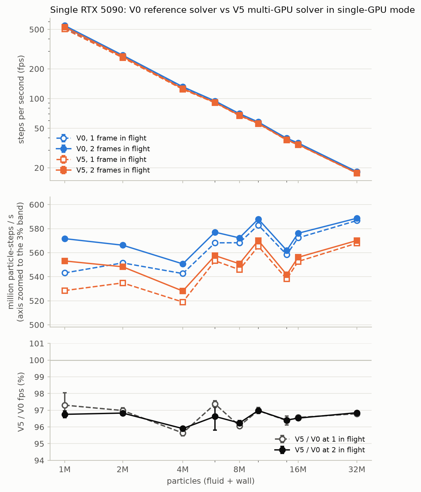

# 单卡基线:V0 参考求解器 vs V5 多卡求解器的单卡模式(2026-09-23)

## 目的

为论文提供单 GPU 基线,并回答"多卡设计是否损害单卡性能":

- **V0** = 仓库里的参考单卡求解器(`utils/sph/` + `shaders/sph/`,`_run_viewer.py` 背后的代码路径)。它没有正式名称,也没有无头基准入口;本次新增 `_run_single_baseline_bench.py` 作为其基准入口。V0 原生循环是同步的:每步一次 `vkQueueSubmit` + fence 等待(1 帧在飞)。
- **V5 单卡模式** = 多卡求解器 `experiment/v5/SphSimulatorV5` 在无 peer 时的合并单步路径(predict → update_voxel → correction_all → density_all → force_all),无 ghost、无 timeline 信号量、无 worker 线程。

两者都以 1 帧在飞(各自的原生 submit+wait 循环)和 2 帧在飞(在同一条 `SIMULTANEOUS_USE` step 命令缓冲上用 fence 环提交,GPU 队列在两步之间不排空)各测一次。求解器代码本身未改动。

## 方法

| 项 | 设置 |
|---|---|
| 硬件 | 单张无显示器的 RTX 5090(nvidia-smi index 1,PCI 03:00.0,按 UUID 固定),driver 576.88,600 W 功耗上限 |
| 算例 | 2-D 顶盖驱动方腔,1M–32M(`cases/lid_driven_cavity_2d_{gen,2m,4m,6m,8m,10m,14m,16m,32m}`),h/dx = 5,c0 = 100,γ = 7;1M 用与 2M–32M 同一生成器/同一物理参数的 `_gen` 算例;重调参过的 `lid_driven_cavity_2d`(c0 = 20,γ = 1.4)单列为 `1m_orig` |
| 度量 | fps = 计时窗口步数 / 墙钟时间;计时窗口起止都在 GPU 队列排空(所有 fence 等待完成)时取,因此对任意在飞深度都精确。无 GPU 时间戳,验证层关闭 |
| 窗口 | 预热 1000 步;计时 10000(1M)/ 6000(2M)/ 4000(4M)/ 3000(6M)/ 2000(≥8M)步,均为 1000 步 defrag 周期的整数倍,窗口内 defrag 次数一致 |
| 重复 | 每个点 3 次,四种配置在同一尺寸内背靠背交错运行、每轮轮换顺序,消除热态/流动发展的偏置;比值按"同一轮的 V5 / 同一轮的 V0"计算再取均值±标准差 |
| 协变量 | nvidia-smi 1 Hz 采样 SM 频率 / 功耗 / 温度;全程 600 W 封顶,SM 2706–2816 MHz,最高 71 °C |
| 守恒 | 每次运行结束回读 alive 粒子数;120 次运行 drift 全部为 0,无 overflow |

脚本:`_run_single_baseline_bench.py`(单次运行)、`_run_single_baseline_campaign.py`(整场,子进程隔离,可续跑)、`_summarize_single_baseline.py`(表 + 图)。原始数据 `logs/single_baseline_20260923/`(`results.jsonl`、`telemetry.csv`、`runs/*.log`、`summary.md`)。

## 结果

### 吞吐(fps,均值 ± 标准差,n = 3)

| 尺寸 | 粒子数 | V0 同步 | V0 2 帧在飞 | V5 同步 | V5 2 帧在飞 |
|---|---|---|---|---|---|
| 1M | 1,046,529 | 519.0 ± 4.3 | 546.2 ± 1.1 | 505.0 ± 0.3 | 528.5 ± 0.1 |
| 1M-orig | 1,046,529 | 537.2 ± 1.1 | 564.6 ± 0.4 | 502.0 ± 1.1 | 525.6 ± 0.6 |
| 2M | 2,064,969 | 267.1 ± 0.1 | 274.2 ± 0.3 | 259.0 ± 0.5 | 265.5 ± 0.3 |
| 4M | 4,182,025 | 129.8 ± 0.1 | 131.7 ± 0.1 | 124.1 ± 0.1 | 126.3 ± 0.2 |
| 6M | 6,105,841 | 93.1 ± 0.2 | 94.5 ± 0.3 | 90.6 ± 0.1 | 91.3 ± 0.5 |
| 8M | 8,128,201 | 69.9 ± 0.0 | 70.4 ± 0.1 | 67.2 ± 0.0 | 67.8 ± 0.1 |
| 10M | 10,144,225 | 57.5 ± 0.0 | 58.0 ± 0.1 | 55.7 ± 0.1 | 56.2 ± 0.1 |
| 14M | 14,160,169 | 39.4 ± 0.0 | 39.7 ± 0.0 | 38.0 ± 0.1 | 38.3 ± 0.0 |
| 16M | 16,184,529 | 35.4 ± 0.0 | 35.6 ± 0.0 | 34.1 ± 0.0 | 34.4 ± 0.0 |
| 32M | 32,251,041 | 18.2 ± 0.0 | 18.3 ± 0.0 | 17.6 ± 0.0 | 17.7 ± 0.0 |

### 比值(逐轮比值的均值 ± 标准差,n = 3)

| 尺寸 | V5/V0 @ 同步 | V5/V0 @ 2 帧在飞 | V0:2 帧 / 同步 | V5:2 帧 / 同步 |
|---|---|---|---|---|
| 1M | 97.3% ± 0.7 | 96.8% ± 0.2 | 105.3% ± 1.1 | 104.7% ± 0.1 |
| 1M-orig | 93.5% ± 0.1 | 93.1% ± 0.1 | 105.1% ± 0.3 | 104.7% ± 0.3 |
| 2M | 97.0% ± 0.2 | 96.8% ± 0.1 | 102.7% ± 0.1 | 102.5% ± 0.2 |
| 4M | 95.6% ± 0.2 | 95.9% ± 0.1 | 101.5% ± 0.0 | 101.8% ± 0.3 |
| 6M | 97.4% ± 0.2 | 96.6% ± 0.8 | 101.6% ± 0.6 | 100.8% ± 0.4 |
| 8M | 96.1% ± 0.1 | 96.2% ± 0.1 | 100.7% ± 0.2 | 100.9% ± 0.1 |
| 10M | 97.0% ± 0.2 | 97.0% ± 0.1 | 100.9% ± 0.2 | 100.9% ± 0.4 |
| 14M | 96.4% ± 0.3 | 96.4% ± 0.0 | 100.6% ± 0.0 | 100.7% ± 0.2 |
| 16M | 96.6% ± 0.0 | 96.5% ± 0.1 | 100.7% ± 0.0 | 100.6% ± 0.1 |
| 32M | 96.8% ± 0.0 | 96.9% ± 0.1 | 100.3% ± 0.0 | 100.4% ± 0.0 |

### 粒子吞吐(百万粒子·步 / 秒,由均值 fps 换算)

| 尺寸 | V0 同步 | V0 2 帧 | V5 同步 | V5 2 帧 |
|---|---|---|---|---|
| 1M | 543 | 572 | 528 | 553 |
| 2M | 552 | 566 | 535 | 548 |
| 4M | 543 | 551 | 519 | 528 |
| 6M | 568 | 577 | 553 | 558 |
| 8M | 568 | 572 | 546 | 551 |
| 10M | 583 | 588 | 565 | 570 |
| 14M | 558 | 562 | 538 | 542 |
| 16M | 572 | 576 | 553 | 556 |
| 32M | 587 | 589 | 568 | 570 |

### 图

上:fps–N(双对数);中:粒子吞吐(纵轴放大到 3% 区间);下:同一在飞深度下 V5/V0,误差棒为逐轮比值的标准差。

## 结论(可直接用于论文)

1. **多卡求解器在单卡模式下的代价是 3.2%(95.6–97.4%),与 N 无关,3 轮标准差 ≤ 0.8%。** 这不是"零退化",但是一个稳定、可量化、与问题规模无关的常数,1M–32M 全程成立。重调参的 1M-orig 算例上为 93%(该算例 c0 = 20、γ = 1.4,V0 在其上比在 `_gen` 算例上快 3.5%,V5 反而略慢;两者的绝对差异集中在这一个算例,论文曲线不用它)。
2. **2 帧在飞对两种求解器的收益相同:1M 时 +5%,2M +2.6%,4M +1.6%,≥8M ≤ 1%,32M +0.3%。** 这对应每步约 100 µs 的暴露 CPU 提交气泡(fence 唤醒 → Python → 下一次提交),在 1M(每步 1.9 ms)上占 5%,在 32M(每步 55 ms)上可忽略。因此 V0 的同步循环并非其性能损失来源;把 V0 改成 2 帧在飞后,V5/V0 的比值不变。
3. **两种求解器的单卡粒子吞吐都在 540–590 M 粒子·步/秒,且随 N 缓慢上升**(4M 处有一个 3–4% 的低谷,两者同步出现,属算例/网格效应而非求解器差异)。
4. 卡全程处于 600 W 功耗墙,SM 频率 2706–2816 MHz,两种求解器在同一尺寸下频率差 < 0.5%;温度 ≤ 71 °C,无节流。频率作为协变量记录在 `summary.md`。

## 这 3% 落在哪里(诊断)

### 排除:`SHARING_MODE_CONCURRENT`

V5 为了让传输队列直接 DMA,把 12 个 set-0/1/3 缓冲声明为 CONCURRENT(compute + transfer 两个队列族),文档一直估计其代价"3–5%"。用新增的诊断开关 `V5_CONCURRENT_BUFFERS=0`(仅单卡可用,全部改为 EXCLUSIVE)做 A/B(1 次,同一卡,同窗口;对照为主表 V5 的 3 轮均值):

| 尺寸 | 在飞 | CONCURRENT(主表) | EXCLUSIVE | 差 |
|---|---|---|---|---|
| 2M | 1 | 259.0 | 258.6 | −0.2% |
| 2M | 2 | 265.5 | 265.9 | +0.1% |
| 8M | 1 | 67.2 | 66.9 | −0.4% |
| 8M | 2 | 67.8 | 68.6 | +1.2% |
| 32M | 1 | 17.6 | 17.60 | 0 |
| 32M | 2 | 17.7 | 17.67 | 0 |

共享模式最多贡献 ~1%(仅 8M 2 帧在飞一点),不是主因。数据 `logs/single_baseline_20260923/exclusive_ab/`。

### 定位:逐 kernel GPU 时间戳(`_run_kernel_breakdown.py`,同步循环,每步 6 个 BOTTOM_OF_PIPE 时间戳,预热 1000 + 计时 2000 步,defrag 帧剔除)

| kernel(µs/步) | 2M V0 | 2M V5 | Δ | 8M V0 | 8M V5 | Δ |
|---|---|---|---|---|---|---|
| predict | 94.4 | 94.1 | 0 | 493.7 | 493.9 | 0 |
| update_voxel | 35.6 | 35.6 | 0 | 336.3 | 335.3 | 0 |
| correction | 991.1 | 982.5 | −0.9% | 3888.8 | 3880.2 | −0.2% |
| density(含 scratch→primary 拷贝) | 1089.1 | 1139.8 | **+4.7%** | 4214.6 | 4431.3 | **+5.1%** |
| force | 1325.6 | 1406.0 | **+6.1%** | 5136.3 | 5488.8 | **+6.9%** |
| GPU 帧总计 | 3535.8 | 3657.9 | +3.5% | 14069.7 | 14629.5 | +4.0% |
| CPU 侧 fps(同一运行) | 270.2 | 261.8 | −3.1% | 69.7 | 67.1 | −3.7% |

**全部差异来自 density 和 force 两个 kernel**(各 +5% / +6–7%),predict、update_voxel、correction 逐 µs 一致。三个邻居遍历 kernel 的内层循环源码在 V0 与 V5 之间逐行相同;V5 的差异在循环之外:(a) 为使 x 列 slab 连续而改用 x-slowest 的 `voxel_id` 编码(粒子在 defrag 排序后的内存顺序随之改变),(b) 每个粒子一次 `in_boundary_band` 分类(单卡下为常量,被 DCE)。代价只出现在每个邻居读取字节最多的两个 kernel(density/force 读 velocity、density、correction_inverse、density gradient;correction 只读 position/mass),与"slab 友好的 voxel 编码带来的访存局部性差异"一致;这是多卡 1-D slab 分解的固有数据布局代价,而不是 ghost/迁移/同步逻辑的运行时开销(单卡模式下这些路径根本不执行)。数据 `logs/single_baseline_20260923/kernel_breakdown/`。

同一份时间戳还给出同步循环的 CPU 气泡:2M 时 GPU 帧 3536 µs 对应 282.8 fps,而 CPU 侧只有 270.2 fps,气泡 ≈ 165 µs/步(4.6%);2 帧在飞把 V0 提到 274.2 fps,收回其中大部分。

## 与旧数据的关系

- V5 单卡的 2026-06-19 曲线数据(`logs/scaling_2x5090.jsonl`,同步循环,带 GPU 时间戳,预热 5000)为 1M 506.5、2M 262.8、8M 68.1、32M 17.7 fps;本次同步模式为 505.0 / 259.0 / 67.2 / 17.6,一致(≤ 1.5%,差异来自时间戳与预热长度)。
- 论文中引用单卡强扩展参考值时,应使用本表的 **V5 同步** 列(与双卡 K=1 参考的测法一致)或注明在飞深度。
