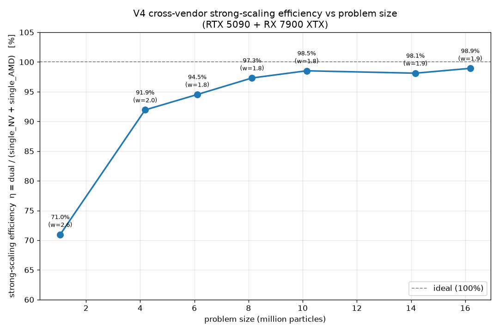
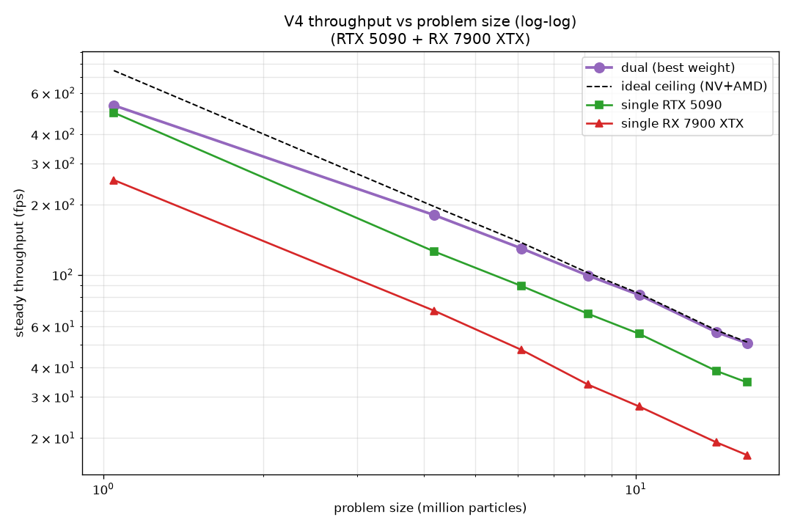
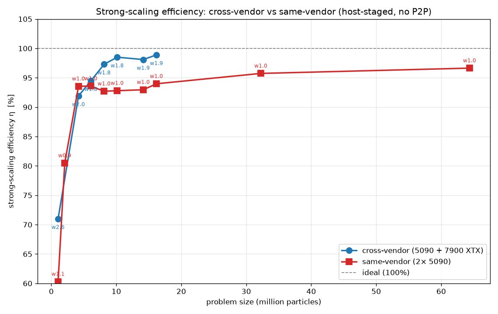
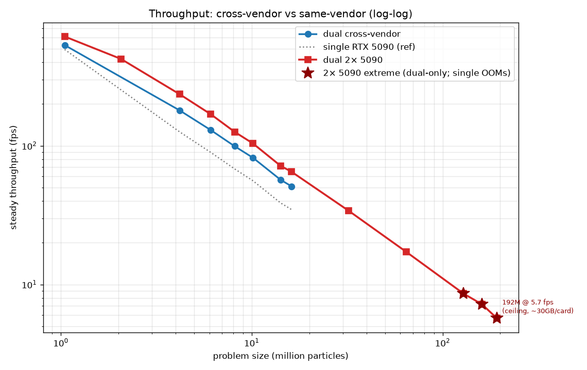

# SPH V4 — Summary & Entry Point

> **Purpose of this doc:** a cold-start entry point for a new session/model picking up the V4
> multi-GPU SPH solver. It states what V4 is, what has been done & measured, where the bottleneck
> now is, and the single highest-value next step. Read this first, then `docs/sph_v2_design.md`
> (V4 inherits V2's architecture) and the `memory/` notes referenced at the bottom.

Last updated: 2026-06-18. Primary rig (all of §1–§3): AMD Radeon RX 7900 XTX (device 0) + NVIDIA
RTX 4060 Ti (device 1), cross-vendor single machine. **A second rig (RTX 5090 + 7900 XTX) was
benchmarked 2026-06-17 — see §3b; on it the device order and weight semantics INVERT.** Case:
`cases/lid_driven_cavity_2d/` (1M, 1,046,529 particles) and `cases/lid_driven_cavity_2d_4m/`
(4M, 4,182,025 particles).

---

## 0. TL;DR

- **V4 = a clean copy of the V2 "Path A+" architecture** (the fast CPU-worker + transfer-queue design),
  renamed `v2`→`v4`, plus four self-contained improvements (below). **V3's shared-host-transport
  architecture was measured ~7% slower and is NOT adopted** — do not build on `experiment/v3/`.
- **Orchestration is essentially optimized.** Strong-scaling efficiency: **1M 81.6%→89.6%**, **4M
  87%→92.2%**, all `drift=0`. The three orchestration levers (per-slab pool sizing + K_split
  rebalance + submit-ahead/depth-2 pipelining) are done and validated at both scales.
- **The remaining bottleneck is inside the compute kernels.** The transfer chain is only ~850µs
  (phase_b has ~700µs of headroom — NOT transfer-floored), and `ncu/nsys` profiling shows the
  neighbor kernels (correction/density/force) are **latency-bound** (irregular gather), not
  compute- or bandwidth-bound.
- **Highest-value next step:** reduce the per-neighbor *gather* — the biggest lever is **fusing the
  three neighbor traversals** (correction/density/force each independently re-gather the same
  neighbors) so each neighbor is loaded once and reused. Constraint: it must coexist with the
  Path A+ cascading split bands. First sub-task: assess fusing correction+density (both in phase_b).
- **Do NOT pursue:** the 2D mat3→2×2 inverse micro-opt (compute reduction; kernels aren't
  compute-bound — confirmed by profiling). Don't shrink ghost fields to speed the *compute* kernels
  (they aren't DRAM-bandwidth-bound; ghost shrink only helps the separate PCIe transfer chain).

---

## 1. Architecture recap (V4 = V2 Path A+)

Per-GPU 1D slab decomposition along x, 1-voxel ghost, voxel-sorted single own-particle SoA. δ-plus
WCSPH, leapfrog integration, persistent uniform voxel grid. Full design in `docs/sph_v2_design.md`.

**Per-frame timeline (5N timeline semaphore, one per sim):**
- `phase_a` (compute Q): predict → update_voxel → ghost_send. Signals `5N+1`.
- transfer Q: readback DMA (device→sender_staging). Signals `5N+2`.
- CPU worker thread: memcpy sender_staging→peer's receiver_staging. Host-signals `5N+3`.
- transfer Q: upload DMA (receiver_staging→device). Signals `5N+4`.
- `phase_b` (compute Q, queue-ordered after A): correction_interior + density_deep_interior.
  **Runs in parallel with the transfer chain to hide it.**
- `phase_c` (compute Q, waits `5N+4`): install_migrations → correction_boundary → density_boundary →
  density-scratch copy-back → force_all. Signals `5N+5` (frame done).

**Cascading interior/boundary split** (to hide the transfer chain behind phase_b): correction band=2
voxels, density band=3, force band=4 (force is NOT split in production — runs `force_all` in phase_c).

---

## 2. What was changed in V4 (vs the V2 copy)

All four are isolated to `experiment/v4/`; V2 stays frozen.

1. **set-3 buffer cleanup.** Removed 5 buffers that were declared but **never read/written by any
   kernel** (`inlet_template`, `dispatch_indirect`, `ghost_out_packet`, `ghost_in_staging`,
   `diagnostic`). Reclaimed binding 3,1 (the never-implemented `overflow_log`) → `PoolHealthBuffer`.
   (`maximum_velocity` in global_status is also dead but left in place to keep the 16-uint/64B
   cache-line layout + readback offsets stable.)

2. **Pool-health watermark** (`PoolHealthBuffer`, set 3 binding 1, 16B). Two never-reset `atomicMax`
   in `install_migrations.comp`: `peak_tail_high_water = max(slot_n+1+alive)` (closest the migrant
   tail ever got to `OWN_POOL_SIZE`) and `peak_migration_count = max(slot_n+1)`. Host reads via
   `simulator_v4.readback_pool_health()`. Gives data-driven pool sizing + a pre-overflow warning
   (warn before a particle is silently dropped). Migrants install at the own-pool tail descending and
   `migration_install_count` resets every defrag, so without this watermark the cross-run worst case
   is invisible.

3. **Per-slab pool sizing.** `partition_v4.compute_dual_gpu_partition(case, weights, pool_safety=None)`.
   Default `None` = legacy global whole-domain pool on both slabs (wastes empty-slot dispatch — NV
   owned 24% but scanned the full 1.2M pool). `pool_safety=1.2` sizes each slab `own_pool =
   ceil(slab_particles × 1.2)`, workgroup-rounded, capped at the global pool. **The pid-offset uses
   slot-0's shrunk pool** (offsets depend only on slot 0's `own_pool_size`), so AMD is safely
   shrinkable too. Self-contained: no shader changes.

4. **Submit-ahead pipelining + migration logging.** `orchestrator_v4.run_pipelined(max_steps, depth=2,
   warmup, on_defrag)` keeps `depth` frames in flight so the GPU never idles on the CPU submit/wait
   round-trip the synchronous `step()` pays every frame. **Safe with single buffers at any depth**:
   the 5N timeline makes worker(n)'s host-signal `5n+3` a prerequisite for frame n+1's readback `5n+7`,
   so no staging buffer is reused before its reader finishes and no host-signal goes backwards
   (validated drift=0 at depth 2 and 3). `step()` (depth-1) is kept for the instrumented bench — under
   pipelining the per-kernel GPU-timestamp slots get overwritten by the in-flight next frame.
   `_collect_defrag_report()` snapshots `migration_install_count` before each defrag for the
   per-interval migration time series.

---

## 3. Measured results (all drift=0, zero overflow)

### Throughput (cavity, steady-state)

| config | 1M fps | 4M fps |
|---|---:|---:|
| baseline (depth-1, no pool shrink, 3.2:1/2.8:1) | ~283 | ~79.3 |
| + per-slab pool + K_split rebalance (depth-1) | 292.9 | 80.7 |
| **+ submit-ahead (depth-2) — full V4 stack** | **310.9** | **83.6** |
| single AMD (warmed, full problem) | 232 | 61.2 |
| single NV (warmed, full problem) | 115 | 29.5 |

Optimal weights: 1M `2.9,1.0`, 4M `2.8,1.0` (hardware-pair-specific). Submit-ahead alone: +16.8 fps
@1M (+5.9%), +2.9 @4M (+3.6%) — smaller % at 4M because the ~200µs CPU bubble is a smaller fraction
of the ~12ms 4M frame. Pool+rebalance alone: +9.6 @1M.

### Strong-scaling parallel efficiency

`η_strong = dual_fps(P) / [single_AMD_fps(P) + single_NV_fps(P)]`, fixed total problem P, references =
warmed single-GPU runs on the **full** problem. (This is **strong** scaling — fixed problem, split
across the GPUs. The 4M>1M trend is the strong-scaling signature: bigger per-GPU slab → fixed overheads
amortized → higher efficiency.)

- **1M: 310.9 / (232+115) = 89.6%** (baseline 283/347 = 81.6%).
- **4M: 83.6 / (61.2+29.5) = 92.2%** (baseline 79.3/90.7 = 87.5%).

`η_weak` (fixed per-GPU slab, isolates pure coordination overhead) is **not yet measured** — needs a
helper to run each slab alone (slab particles + slab grid, ghost=0, transport=None) through the single
bench. Recipe: `η_weak = dual_frame_time / max(AMD_solo(slab_A)_frame_time, NV_solo(slab_N)_frame_time)`.

### Migration flux (PoolHealthBuffer time series)

Per 1000-step defrag interval, migrants installed at the own-pool tail ramp from ~10 (transient) to a
**~80-113/interval plateau** (1M) / **~62/interval** (4M) at steady state. Tiny (≤0.03% of a slab).
So `own_pool_size` is dominated by `alive`; migrant headroom is negligible → **`pool_safety=1.2` is
~1000× more than needed; 1.05× would still be safe.** Size from the never-reset `peak_migration`
watermark at the deployment weights (flux ramps, so short runs under-estimate).

### Transfer chain (direct GPU-timestamp probe, isolated)

| DMA leg | AMD | NV |
|---|---:|---:|
| readback (dev→sender) | 122µs | **482µs** |
| upload (recv→dev) | 124µs | **515µs** |
| worker memcpy (isolated/prod) | ~110 / 238µs | — |

Chain gating each GPU's phase_c ≈ **845-875µs** (with production memcpy). **phase_b is 1547/1630µs →
~700µs of compression room** before the transfer floor. The chain is PCIe/host-bandwidth bound (NV's
host-visible DMA is the bulk and ~4× slower than AMD's), so it barely contends with the VRAM/compute-bound
phase_b → isolated ≈ in-flight. **phase_b is NOT transfer-floored** (this overturned an earlier
b_to_c_gap heuristic that wrongly suggested it was).

### Roofline (NV, via nsys GPU-metrics — `ncu` does NOT hook this Vulkan app)

Heavy-kernel windows (correction/density/force): **DRAM read+write ~14%** (not bandwidth-bound),
**SM-issue ~63%** (not compute-bound), **occupancy ~86%** (warps resident but stalling). →
**latency-bound** (irregular per-neighbor dependent-load chain; L2 absorbs traffic). Implications:
math-reduction won't help, ghost-shrink won't speed compute; the lever is reducing the gather.

---

## 3b. Second rig — RTX 5090 (device 0) + 7900 XTX (device 1), measured 2026-06-17

Cross-vendor, but the FAST card is now the NV 5090 (the inverse of the primary rig). **Device order
inverts: `device[0]`=5090, `device[1]`=7900 XTX** (a third device, the AMD iGPU, enumerates as
`device[2]` — ignore). With the default `--device-a 0 --device-b 1`, **`weights` are now `NV:AMD`**
(primary rig: AMD:NV). The runners' hardcoded `AMD/a` / `NV/b` print labels are therefore swapped —
cosmetic only, the device-index math is correct. Validation must be forced off
(`VK_LOADER_LAYERS_DISABLE=VK_LAYER_KHRONOS_validation`) because the dual runners default
`enable_validation=True` and this rig has the full SDK's validation layer installed.

**Full 7-point scaling curve (measured 2026-06-18; all drift=0, no overflow). Single-GPU warmed
steady (frame_total p50) + dual best (depth-2; depth-3 only adds ≤4% at ≤4M):**

| scale | total | 5090 | 7900 XTX | NV:AMD | ceiling | best w | dual fps | **η_strong** |
|---|---:|---:|---:|---:|---:|---:|---:|---:|
| 1M  | 1.05M  | 494  | 254  | 1.94 | 748   | 2.6 | 531 (d3) | 71.0% |
| 4M  | 4.18M  | 126  | 70   | 1.80 | 196   | 2.0 | 180 (d3) | 91.9% |
| 6M  | 6.11M  | 89.4 | 47.6 | 1.88 | 137   | 1.8 | 129.5    | 94.5% |
| 8M  | 8.13M  | 68.1 | 33.9 | 2.01 | 101.9 | 1.8 | 99.2     | 97.3% |
| 10M | 10.14M | 55.9 | 27.3 | 2.05 | 83.1  | 1.8 | 81.9     | 98.5% |
| 14M | 14.16M | 38.7 | 19.2 | 2.02 | 57.9  | 1.9 | 56.8     | 98.1% |
| 16M | 16.18M | 34.6 | 16.9 | 2.05 | 51.5  | 1.9 | 50.9     | **98.9%** |

 

(6M–16M cases generated by `utils/geometry/_demo_cavity_case.py`; campaign `experiment/v4/_run_scaling_campaign.py`
→ `logs/scaling_results.jsonl`; plots `_plot_scaling.py`.) The curve is the strong-scaling signature:
**η climbs 71% → 99% and saturates near ideal by ~10M** (dual reaches the NV+AMD ceiling), and the
**optimal weight converges 2.6 → 1.8–1.9** (down toward — and slightly below — the single-GPU ratio).

**Depth-3 helps only at ≤4M** (1M +4% vs depth-2, 4M +1.6%, ≥6M +0): the ~200µs CPU submit bubble is a
big fraction of the ~2ms 1M frame but negligible vs the multi-ms frames at scale. depth-4/5/6 plateau
~528 @1M; all drift=0 to depth-6.

**Per-phase breakdown (depth-1 instrumented):**

| | NV phase_a | NV phase_b | NV b_to_c_gap | NV phase_c | AMD phase_a | AMD phase_b | AMD b_to_c_gap | AMD phase_c |
|---|---:|---:|---:|---:|---:|---:|---:|---:|
| 1M (w2.6) | 104µs | 783µs | **370µs** | 759µs | 104µs | 639µs | **502µs** | 556µs |
| 4M (w2.0) | 303µs | 2788µs | **7µs** | 2265µs | 651µs | 2833µs | **9µs** | 2248µs |

**Transfer chain (isolated probe, lower bound):** per-leg device↔host DMA = 5090 ~120µs, 7900 XTX
~232µs @1M (5090's PCIe-5 DMA is ~2× faster — opposite of the primary rig where the 4060 Ti was the
slow leg); chain gating each phase_c ≈ 445µs @1M / 890µs @4M. **In-flight the chain is much longer
than isolated**: worker memcpy inflates 90µs→440µs @1M (CPU/GIL contention) and worker_wait ≈ 850µs,
so the 1M `b_to_c_gap` (~400µs) is dominated by cross-GPU sync + CPU-worker latency, NOT raw DMA.

**Mechanism — why 1M scales to only 71% but 4M to 92%:** at 1M the 5090's phase_b (~700–780µs) cannot
hide the in-flight transfer/worker chain → ~400µs leaks into the critical path every frame → flat
weight curve, transport-floored. At 4M phase_b grows to ~2800µs and fully swallows the chain
(`b_to_c_gap`≈8µs) → genuine compute-balance optimum, near-ideal scaling. This is the strong-scaling
signature, now quantified on a fast-NV pair: **the cross-vendor CPU-staged transport is a fixed
overhead that amortizes with problem size.** It is exactly the regime the design says needs
same-vendor P2P (V3.2) for the 2×5090 primary target.

**Reading the 98.9% (16M):** η_strong = dual / (single_NV + single_AMD) = 50.9 / 51.5 — the dual is
within 1.1% of the *combined raw throughput of both cards*, despite carrying ghost particles, the PCIe
transport, and 2× the CPU coordination. Why it gets there: the per-frame overhead is roughly fixed
(transfer data scales with the boundary column ~√N, the ghost is one voxel thick), while per-GPU
compute scales with N — so overhead/compute ~ 1/√N → vanishes. Honest framing: large-N efficiency is
the "easy" end (any well-overlapped multi-GPU code amortizes a fixed overhead); the architecture-
revealing number is the **1M 71%**, where the overhead is fully exposed. Equivalent framing of the
16M result: dual / single-5090 = 50.9/34.6 = **1.47× speedup from adding the AMD card** — i.e. it
captures 98.9% of the AMD's ideal +49% contribution. The residual ~1.1% is **static load imbalance**
(the weight sweep granularity is 0.1) **+ a small coordination tail**; a finer split or V3.1 dynamic
load balancing would close most of it. Note the optimum weight **1.8–1.9 sits BELOW the single-GPU
ratio ~2.0–2.05** — i.e. AMD is given a bit *more* than its solo-throughput share, because in dual
mode the 5090's effective per-particle throughput drops (the documented NV CONCURRENT-buffer / cross-
family regression + its slower host-DMA on the transfer critical path), so the *dual-effective* ratio
is lower than the solo ratio. **Implication:** the cross-vendor transport is NOT a scaling bottleneck
at production size; same-vendor P2P (V3.2) buys mainly (a) small-N / latency-bound regimes and (b)
absolute fps, not large-N strong-scaling efficiency, which is already ~99%.

**vs primary rig (4060 Ti + AMD, where AMD was fast):** primary 1M = 310.9 fps / 89.6% / w2.9 (AMD:NV);
primary 4M = 83.6 / 92.2% / w2.8. This rig is **1.71× faster @1M** (531) and **2.15× faster @4M** (180);
4M efficiency matches (~92%), but 1M efficiency DROPS (71% vs 90%) because the much-faster 5090 outpaces
the cross-vendor transport at small problem size.

**Production commands (this rig):**
```bash
# 1M  (best: weights 2.6,1.0  depth 3)
VK_LOADER_LAYERS_DISABLE=VK_LAYER_KHRONOS_validation .venv/Scripts/python.exe \
  experiment/v4/_run_v4_dual_pipeline.py --device-a 0 --device-b 1 \
  --weights 2.6,1.0 --pool-safety 1.2 --depth 3 --max-steps 13000 --warmup 5000
# 4M  add: --case cases/lid_driven_cavity_2d_4m/case.yaml --weights 2.0,1.0
```

---

## 3c. Third rig — 2× RTX 5090 (SAME-VENDOR, paper-primary), measured 2026-06-19

The 7900 XTX was swapped for a second 5090 (riser cable; **PCIe x8/x8** Gen5 from 2-GPU bifurcation,
ReBAR on). `device[0]`/`device[1]` = the two 5090s (AMD iGPU `[2]`, ignore); weights are symmetric (NV:NV).

**THE P2P GATE FAILED — no peer-to-peer on consumer GeForce.** Both same-vendor fast-transport paths
are unavailable: (1) **OPAQUE_WIN32 external-memory import FAILS even NV→NV** — the driver advertises
the handle type EXPORTABLE+IMPORTABLE but `vkGetMemoryWin32HandlePropertiesKHR` → `INITIALIZATION_FAILED`
and the import alloc → `OUT_OF_DEVICE_MEMORY` (verified with the *correct* probe that queries handle
props + uses a dedicated alloc: `experiment/v5/_probe_p2p_interop.py`); (2) **`VK_KHR_device_group`** —
the two 5090s are in **separate groups of 1** (no NVLink, no SLI on Blackwell). So the old cross-vendor
"P2P doesn't work" was a real driver limit, not just a probe bug. **Consequence: the V3.2 P2P-backend
premise is dead — even the paper-primary 2×5090 uses the same `CpuStagingBackend` as cross-vendor.**
Nothing to build; the existing code runs as-is. *"Consumer GeForce has no usable P2P" is itself a paper finding.*

**Full curve (host-staged, symmetric, depth-2, all drift=0; `logs/scaling_2x5090.jsonl`):**

| N | best w | dual fps | η | single 5090 (dev0/dev1, matched) |
|---|---:|---:|---:|---|
| 1M  | 1.1* | 612.5 | 60.3% | 506.5 / 509.3 |
| 2M  | 0.9* | 422.1 | 80.5% | 262.8 / 261.7 |
| 4M  | 1.0  | 235.4 | 93.6% | 126.2 / 125.4 |
| 6M  | 1.0  | 168.4 | 93.6% | 90.2 / 89.7 |
| 8M  | 1.0  | 125.9 | 92.7% | 68.1 / 67.7 |
| 10M | 1.0  | 103.8 | 92.8% | 56.2 / 55.7 |
| 14M | 1.0  | 71.6  | 93.0% | 38.6 / 38.4 |
| 16M | 1.0  | 64.8  | 94.0% | 34.5 / 34.4 |
| 32M | 1.0  | 33.9  | 95.7% | 17.71 / 17.70 |
| 64M | 1.0  | 17.2  | 96.6% | 8.92 / 8.88 |

(*1M/2M peaks noisy; 4M+ clean at w=1.0.) **η climbs monotonically 60% → 96.6% and keeps approaching ideal at
production scale** (the η_strong sublinear-metric penalty shrinks as N grows — single per-particle rate plateaus
~573 M/s). Comparison figures:  

**Capacity / ceiling (dual-only — single-GPU OOMs beyond ~90M on 32GB):** 2× 32GB = 64GB lets the rig run far past
the cross-vendor AMD-24GB cap (~16–32M). Measured: **128M = 8.6 fps · 160M = 7.2 fps · 192M = 5.7 fps**, all
drift=0, conserved. **192,626,641 particles is the practical ceiling** (~30GB/card incl. the ~1GB desktop on
device[0]; pool 95% used + a <10%-margin warning at pool_safety 1.05 — ~200M would overflow/OOM). Throughput is a
clean ~1/N power law over the full 1M→192M range (>2 orders of magnitude). η at these sizes is estimated ~96–100%
(metric artifact essentially gone) but not directly measured (no single-GPU baseline fits). Cases generated by
`utils/geometry/_demo_cavity_case.py --half {5656|6324|6928}`.

**Single-GPU ceiling + theoretical extrapolation** (`experiment/v5/_run_single_ceiling.py` → `_plot_single_ceiling.py`
→ `docs/single_ceiling.png`): one 5090 (32GB, headless) runs **80M = 7.42 fps, 90M = 6.58 fps, and OOMs at 96M**
(`VkErrorOutOfDeviceMemory` at buffer alloc) → **single-GPU ceiling ≈ 90M particles**. The measured baseline is a
near-perfect 1/N power law; its **peak sustained rate is ~598 M-particles/s**, so the *no-OOM theoretical* line is
`fps = 598/N` (the card meets it at large N, falls slightly below at small N from SM under-occupancy). Key point:
**beyond ~90M the second GPU is needed not for speed but to FIT the problem at all** — single OOMs while dual 2×5090
runs to 192M (2.1× the single memory wall). The figure overlays measured-single + theory-line + dual + the OOM wall.

**Two stories, both true (cross-vendor vs same-vendor):**
1. **Absolute fps: 2×5090 wins everywhere** (~1.15–1.3×; 2M=**422 fps** smashes the 350-fps paper target;
   16M 64.8 vs 50.9). Two fast symmetric cards.
2. **Strong-scaling efficiency: the η curves CROSS** — 2×5090 plateaus ~93–94% and never reaches the
   cross-vendor pair's ~99%; at 1M it is WORSE (60.3% vs 71.0%). **The instrumented `b_to_c_gap` (depth-1,
   w1.0) splits this into TWO distinct regimes:**

   | N | b_to_c_gap (exposed transport) | phase_b | η | regime |
   |---|---:|---:|---:|---|
   | 1M | **~330µs** (NV+AMD both; ~19% of the 1738µs frame) | 566µs | 60% | transport-FLOORED |
   | 8M | **~5µs** (essentially zero) | 3984µs | 93% | transport HIDDEN |

   So **small-N is genuinely transport-floored** (phase_b 566µs < the in-flight chain → ~330µs leaks; the
   ~418µs host-to-host worker memcpy dominates it) → η 60%; 1M dual (612) is only +21% over a single 5090.
   **But the ~93% plateau at large N is NOT transport** (b_to_c_gap ≈5µs — fully hidden). It is mostly a
   **metric/scaling artifact of η_strong**: η_strong = dual(N) / (2·single(N)), yet each 5090 in the dual
   runs only N/2, and **the 5090 is strongly sublinear** (per-particle rate 517 M/s @1M → 527 @4M → 553 @8M
   — fixed per-frame costs amortize), so each GPU's N/2 half runs in a *less-efficient regime* than the
   single-on-full-N reference → ~5–7% "loss" that is a reference choice, not overhead (the dual is ≈100% vs
   the fairer single-on-half reference). The **cross-vendor 99% is partly metric-flattered**: giving the AMD
   card a small ~36% share lands it in its more-efficient small-problem regime. Remaining *real* squeezables:
   **(a) small-N exposed transport** — `PCIe x8/x8` (riser+bifurcation, half BW) and the worker memcpy →
   a clean x16 and/or a shared-host buffer (skip the memcpy) would help most where it matters (real-time
   small sims); **(b) `device[0]` is the DISPLAY GPU** (~6% extra mem-BW from the desktop) → move display to
   the iGPU; **(c)** the depth-2 CPU submit bubble. Binning/thermals are NOT a factor (both cards boost to
   ~2835–2895 MHz, both at the 600 W limit, ~65°C, no throttle).

**Paper framing:** primary (2×5090) → absolute throughput; portability (cross-vendor) → the 99% efficiency
curve. Both validate the universal host-staged architecture (no P2P anywhere on consumer cards). Reproduce:
`experiment/v5/_run_scaling_campaign.py` (symmetric sweep) + `_plot_compare.py`.

---

## 4. How to run / reproduce

```bash
# compile shaders (emits experiment/v4/shaders/spv/, gitignored)
.venv/Scripts/python.exe experiment/v4/compile_shaders_v4.py

# single-GPU bench (full problem on one device; warmup matters — AMD needs ~5000 frames)
.venv/Scripts/python.exe experiment/v4/_run_v4_single_bench.py --device 0 --max-steps 12000 --bench-window 3000

# dual bench — INSTRUMENTED, depth-1 (per-kernel GPU timestamps + migration series + pool_health)
.venv/Scripts/python.exe experiment/v4/_run_v4_dual_bench.py \
    --weights 2.9,1.0 --pool-safety 1.2 --max-steps 9000 --warmup 5000

# dual pipeline — SUBMIT-AHEAD (depth-2), throughput + migration series (no per-kernel timestamps)
.venv/Scripts/python.exe experiment/v4/_run_v4_dual_pipeline.py \
    --depth 2 --weights 2.9,1.0 --pool-safety 1.2 --max-steps 18000 --warmup 5000

# transfer-chain probe (isolated DMA leg timing)
.venv/Scripts/python.exe experiment/v4/_probe_transfer_chain.py --weights 2.9,1.0 --pool-safety 1.2 --iters 200

# 4M: add --case cases/lid_driven_cavity_2d_4m/case.yaml --weights 2.8,1.0
```

**Profiling note:** Nsight Compute (`ncu`) reports "No kernels profiled" on this Vulkan app (it targets
CUDA; Vulkan compute roofline needs Nsight Graphics, not installed). Use **Nsight Systems GPU-metrics**:
`nsys profile --gpu-metrics-devices=0 --trace=vulkan ...`, then `nsys export --type sqlite` and query
`GPU_METRICS` + `TARGET_INFO_GPU_METRICS` (metric names: "SM Issue", "DRAM Read/Write Bandwidth",
"Compute Warps in Flight"). Tools under `C:/Program Files/NVIDIA Corporation/Nsight {Compute,Systems}/`.

---

## 5. Key files (`experiment/v4/`)

| file | role |
|---|---|
| `utils/simulator_v4.py` | per-GPU sim: buffers, pipelines, phase A/B/C + transfer cmds, defrag, `readback_pool_health` |
| `utils/orchestrator_v4.py` | `DualGpuOrchestratorV4`: `step()` (depth-1 instrumented), **`run_pipelined(depth)`** (submit-ahead), `_collect_defrag_report` |
| `utils/partition_v4.py` | `compute_dual_gpu_partition(case, weights, pool_safety=)` — per-slab pool + offsets |
| `utils/transport_v4.py` | `GhostMigrationWorker` (CPU-staged 3-hop transport, one thread per direction) |
| `utils/{case_v4,case_loader_v4,vulkan_context_v4,bench_v4,renderer_v4,debug_log_v4}.py` | case model / loader / VK ctx / GPU-timestamp bench / viewer / debug snapshots |
| `shaders/common.glsl` | spec consts + descriptor layout + **`PoolHealthBuffer`** |
| `shaders/install_migrations.comp` | migrant install + the two pool-health `atomicMax` |
| `shaders/{predict,update_voxel,ghost_send,correction,density,force,defrag,...}.comp` | the kernels |
| `_run_v4_single_bench.py` / `_run_v4_dual_bench.py` / `_run_v4_dual_pipeline.py` | runners |
| `_probe_transfer_chain.py` | transfer-chain DMA-leg probe |

---

## 6. Next steps (priority order)

1. **Reduce the neighbor gather (latency-bound).** Biggest lever. correction/density/force each do an
   independent 27-voxel scattered gather of the same neighbors. **Fuse them** so each neighbor's data
   is loaded once and reused across the three computations (~3× less gather-latency exposure).
   Constraint: the Path A+ cascading split uses different bands per kernel (correction 2 / density 3 /
   force 4) and density/force have a data dependency (density needs M⁻¹; force needs ρ_{n+1}). **First
   sub-task: assess fusing correction+density** (both already in phase_b; density only needs self's M⁻¹
   which correction just computed). Validate: depth-1 per-kernel delta + depth-2 fps + drift=0.
2. **Secondary gather wins:** fewer wasted candidate loads (~9 voxels × ~25 ≈ 225 candidates, ~2/3
   distance-rejected); better locality (Morton `VOXEL_ORDER=1` is reserved but unused); more ILP/prefetch.
3. **Measure η_weak** (build the slab-only single-run helper) to quantify the residual pure
   coordination overhead — confirms how much orchestration headroom is truly left.
4. **Fundamental ceiling (not recoverable in cross-vendor V4):** NV's cross-family timeline-semaphore
   regression + the ghost/transfer tax. Only same-vendor 2×5090 P2P (a different transport backend)
   removes the regression. This is paper "portability section" material, not a V4 tuning target.

---

## 7. `memory/` notes (also auto-loaded each session)

- `project_v4_branch.md` — V4 is the forward branch; V3 architecture abandoned.
- `project_v3_0_submit_ahead_validated.md` — submit-ahead + pool sizing measured (the +9.6%/+5.4%).
- `project_transfer_chain_measured.md` — transfer chain ~850µs, phase_b not floored.
- `project_kernel_roofline.md` — kernels are latency-bound; profiling method (nsys, not ncu).
- `project_nv_concurrent_regression_negative.md` — NV cross-family regression, 9 experiments falsified.
- `project_v2_baseline_cavity_1m.md` — V2 baseline numbers + throughput-efficiency methodology.
